import Aside from 'src/components/Aside.astro';
import Breadcrumb from 'src/components/Breadcrumb.astro';

- [What is Passwordless Authentication?](#what-is-passwordless-authentication)
- [Other Articles](#other-articles)
- [Why is Passwordless Authentication Important?](#why-is-passwordless-authentication-important)
- [Key Methods Of Passwordless Authentication](#key-methods-of-passwordless-authentication)
  - [Magic Links​](#magic-links)
  - [One-Time Passwords (OTPs)​](#one-time-passwords-otps)
  - [TOTPs ?](#totps-)
  - [Biometric Authentication​](#biometric-authentication)
  - [Passkeys (FIDO2/WebAuthn)​](#passkeys-fido2webauthn)
- [Passwordless Options Offered By FusionAuth](#passwordless-options-offered-by-fusionauth)
  - [Magic Links](#magic-links-1)
  - [One-Time Passwords (OTPs)​](#one-time-passwords-otps-1)
  - [TOTPs ?](#totps--1)
  - [Passkeys (FIDO2/WebAuthn)​](#passkeys-fido2webauthn-1)
  - [Using The FA API](#using-the-fa-api)
  - [Clean Up](#clean-up)
- [Benefits of Passwordless Authentication](#benefits-of-passwordless-authentication)
- [Challenges Solved by Passwordless Authentication](#challenges-solved-by-passwordless-authentication)
- [Passwordless Authentication Use Cases](#passwordless-authentication-use-cases)
- [Types of Passwordless Authentication Solutions](#types-of-passwordless-authentication-solutions)
  - [BY DEPLOYMENT MODEL](#by-deployment-model)
  - [BY FOCUS AREA](#by-focus-area)
- [Nine Key Features to Look for in a Passwordless Authentication Solution](#nine-key-features-to-look-for-in-a-passwordless-authentication-solution)
- [Developer's Checklist for Evaluating Passwordless Solutions](#developers-checklist-for-evaluating-passwordless-solutions)
- [Ready to Go Passwordless?](#ready-to-go-passwordless)
- [TODO](#todo)


## What is Passwordless Authentication?
Passwordless authentication is a modern approach to user authentication that eliminates the need for traditional passwords. Instead, it relies on alternative methods such as biometrics, magic links, one-time passwords (OTPs), or passkeys. This approach enhances security by mitigating risks associated with password theft and improves user experience by removing the
friction of remembering complex passwords.

## Other Articles

- https://fusionauth.io/articles/authentication/passwordless-authentication-security
- https://fusionauth.io/articles/authentication/webauthn
- https://fusionauth.io/articles/authentication/how-passwordless-works
- https://fusionauth.io/articles/authentication/passwordless-sso
- https://fusionauth.io/articles/authentication/webauthn-explained
- https://fusionauth.io/articles/authentication/why-passwordless-authentication-matters

## Why is Passwordless Authentication Important?

Password-based systems are vulnerable to attacks like phishing, credential stuffing, and brute force. Passwordless authentication addresses these challenges by:

1. Enhancing Security: Eliminates weak or reused passwords as an attack vector.
1. Improving User Experience: Reduces login friction and forgotten password issues.
1. Streamlining Onboarding: Simplifies the registration process for new users.
1. Reducing Operational Costs: Decreases password reset requests and support tickets.

## Key Methods Of Passwordless Authentication

### Magic Links​
Users receive an email containing a link that logs them in when clicked.
    - Example: A user clicks a link sent to their email to access their account.

### One-Time Passwords (OTPs)​

An OTP is a one-time password or one-time PIN (where PIN is a personal identification number).

Temporary codes sent via SMS or email for single-use login.
    - Example: A user enters a 6-digit code sent to their phone to log in.

### TOTPs ?

### Biometric Authentication​
Uses physical traits like fingerprints or facial recognition for login.-​
    - Example: A banking app authenticates users via Face ID.

### Passkeys (FIDO2/WebAuthn)​
Cryptographic keys stored on devices replace passwords entirely.
    - Example: Logging in with a fingerprint scanner on a smartphone.

## Passwordless Options Offered By FusionAuth

Let's see which types of passwordless authentication FA offers, and briefly overview how to configure them. Once you're done with article, you might want to read more detail in the official FA [documentation on passwordless authentication](https://fusionauth.io/docs/lifecycle/authenticate-users/passwordless/).

<Aside type="tip">
If you want to test these options yourself, you'll need two things:
- An installation of FA. The easiest way to run FA is in a Docker container. Clone the example GitHub repository [here](https://github.com/fusionauth/fusionauth-example-docker-compose). Open a terminal in the `light` subdirectory, and run `docker compose up` in a terminal to start FA. Log in at http://localhost:9011 with `admin@example.com` and `password`.
- An SMTP server to email codes or links to yourself (the example user). For a quick test, you can [configure your personal Gmail account](https://fusionauth.io/docs/customize/email-and-messages/configure-email#gmail) or use [Mailcatcher](https://mailcatcher.me). You'll learn how to set up mail in the subsection below.

For some advanced features you might also need a [paid FA license or a free community licence](https://fusionauth.io/docs/get-started/core-concepts/plans-features).
</Aside>

### Magic Links

FA supports magic links. You can configure FA to allow a user to log in with magic links in addition to, or as an alternative to, username and password authentication.

Log in to FusionAuth and follow the instructions to [configure Gmail here](https://fusionauth.io/docs/customize/email-and-messages/configure-email#gmail).

{/*
[Gmail key](../../../../public/img/articles/authentication/comprehensive-guide-to-passwordless/gmailKey.webp)

[SMTP](../../../../public/img/articles/authentication/comprehensive-guide-to-passwordless/smtp.webp)
*/}

To configure magic links, follow the [guide](https://fusionauth.io/docs/lifecycle/authenticate-users/passwordless/magic-links). In brief, you need to ensure that you have an email template ready to send the user (which was done for you in the [Kickstart file of the repository](https://github.com/fusionauth/fusionauth-example-docker-compose/blob/main/light/kickstart/kickstart.json) you downloaded) and enable passwordless login in the security tab of the "application" settings (an application is the FA name for a group of users and how they are allowed to log in).

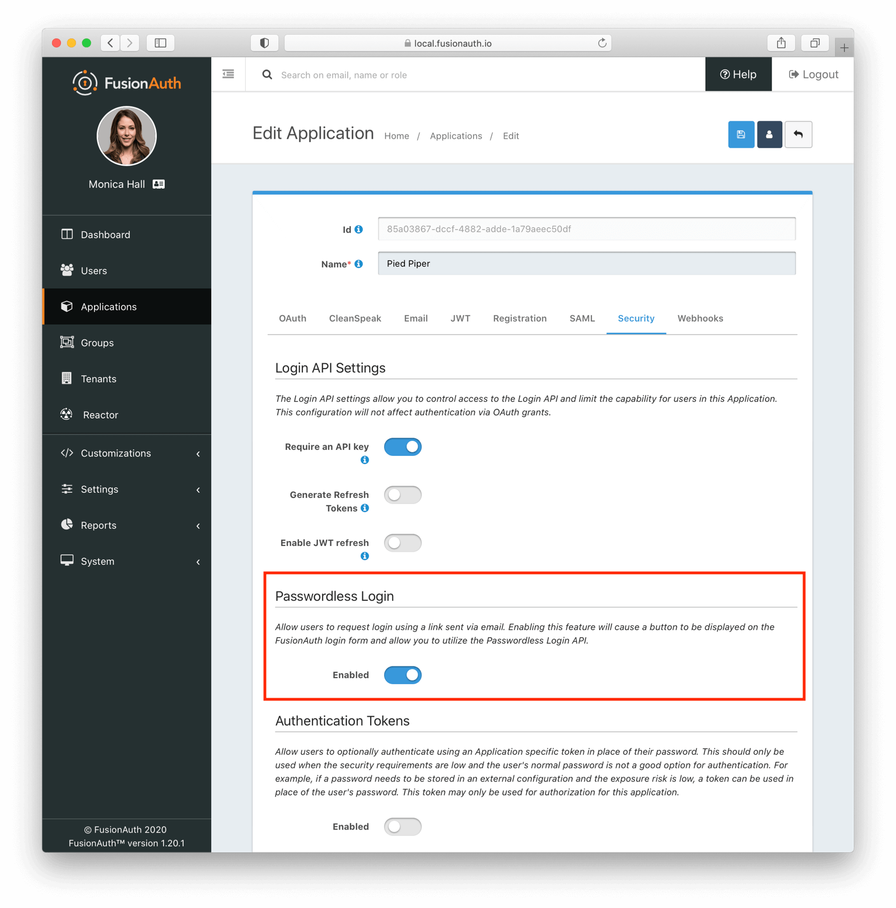

Email templates can be customized in the tenant (a group of FA users and applications), so you can format your magic links and their accompanying message however you like.

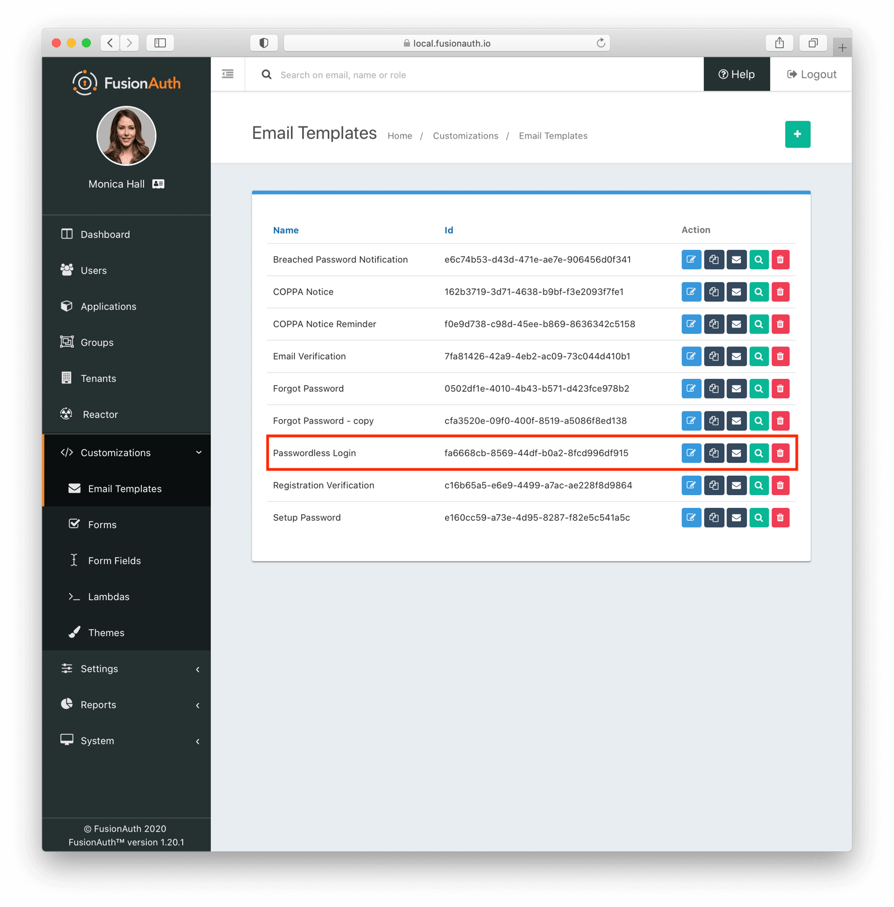

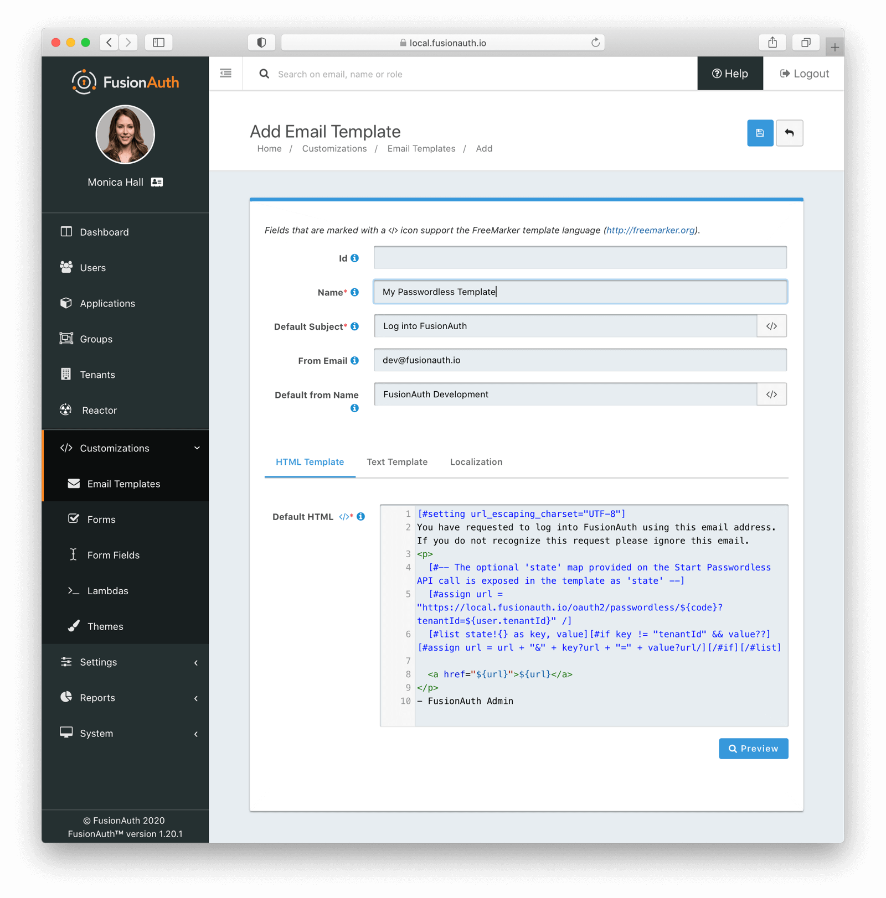

Finally, you need to have a user to test the login. In the <Breadcrumb>Users</Breadcrumb> page you can add a new user with an email address you have access to (like your personal Gmail one), and then add the user to the example Changebank application (this is called a "registration" from the user to the application).

In reality, your application's login page would redirect to a FA page with matching styling, but FA also provides a standalone login page for testing purposes. On the applications page, select View to see more details about the application, including the test OAuth login page, which will be available at http://localhost:9011/oauth2/authorize?client_id=e9fdb985-9173-4e01-9d73-ac2d60d1dc8e&response_type=code&redirect_uri=http%3A%2F%2Flocalhost%3A3000%2Fauth%2Fcallback.

You'll see that the page has a magic link option.

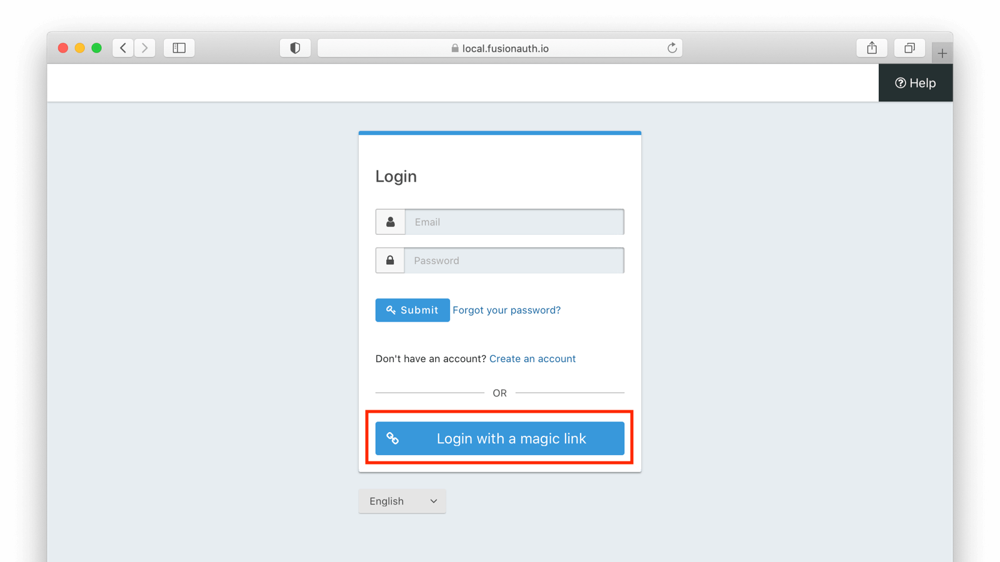

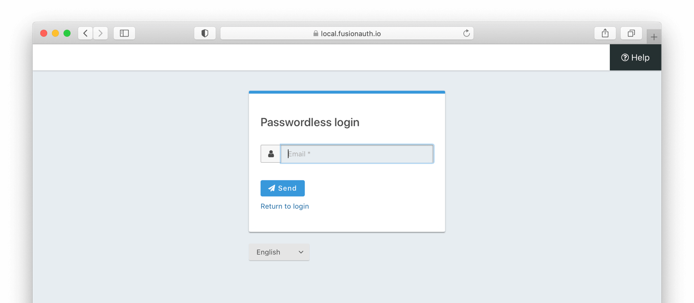

If you enter your email address and click the button a login URL will be emailed to you.

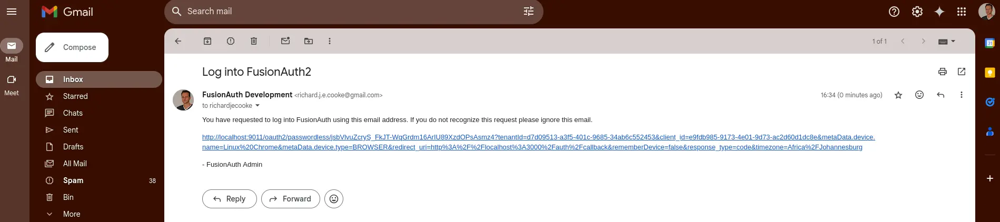

Clicking this link will log you in to FA and redirect you to the website that called it (which doesn't exist since this is just a test).

For more information on magic links in FA, read the [documentation](https://fusionauth.io/docs/lifecycle/authenticate-users/passwordless/magic-links).

### One-Time Passwords (OTPs)​

An OTP can be used in two ways: as an alternative to entering a password, or in addition to entering a password.

FusionAuth doesn't support the former case. There isn't usually a need for this, as the process is effectively identical to being emailed a magic link for login, except the message is a PIN not a URL.

In the latter case, an OTP is called multi-factor authentication (MFA) or two-factor authentication (2FA). This isn't passwordless authentication, as you still have to enter a password, with the extra effort of entering an OTP too. However, entering an OTP does reduce some security flaws of passwords.

To configure 2FA, follow the [guide](https://fusionauth.io/docs/lifecycle/authenticate-users/multi-factor-authentication). In brief, you need to enable email in your tenant multi-factor tab and set multi-factor login policy to `required` for your application.


Now when a user logs in, they will be asked to configure MFA. In this example, you can choose email authentication.

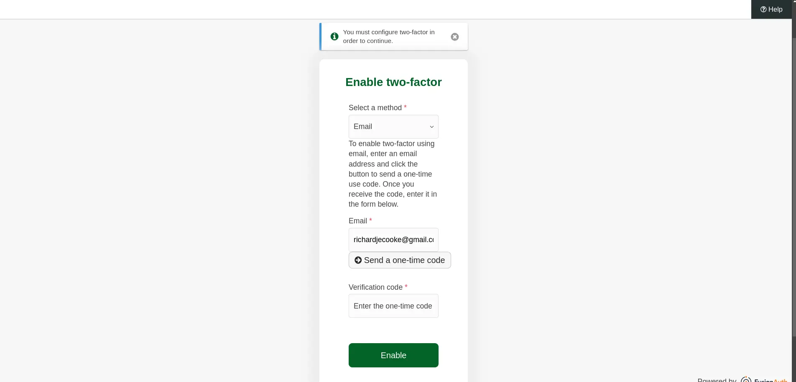

You'll receive a password via email.

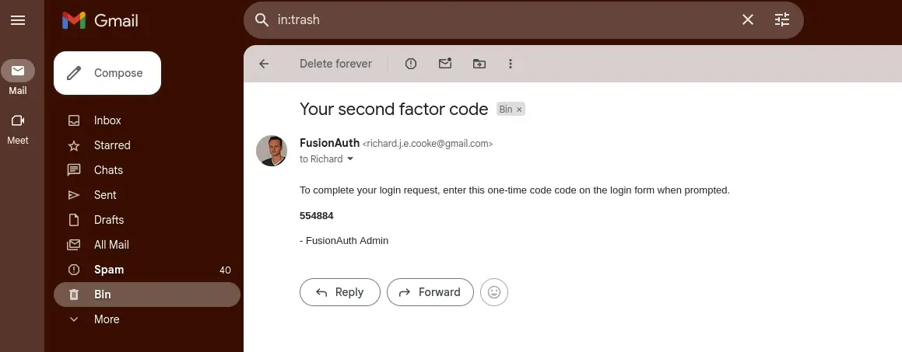


After logging in, you'll be able to save recovery codes in case you lose access to your email account.

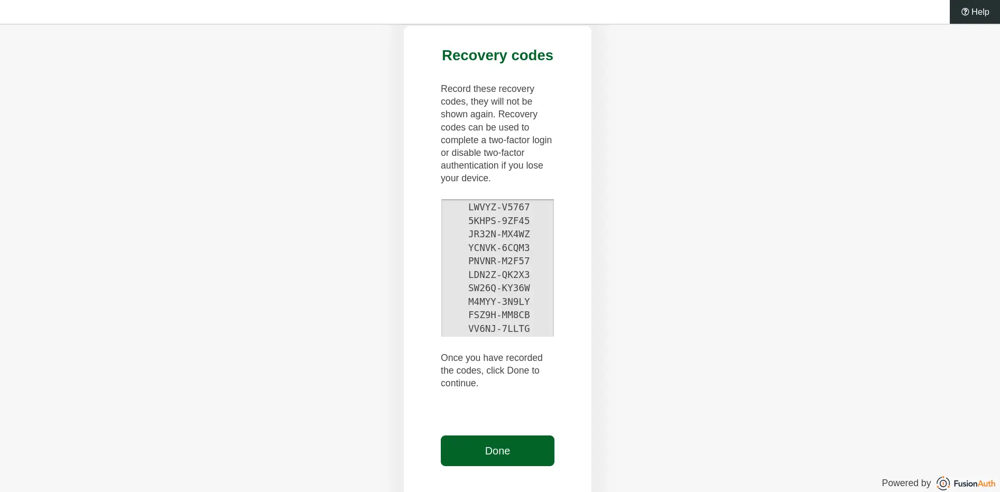

Now that email authentication is configured, the MFA login will be simpler.

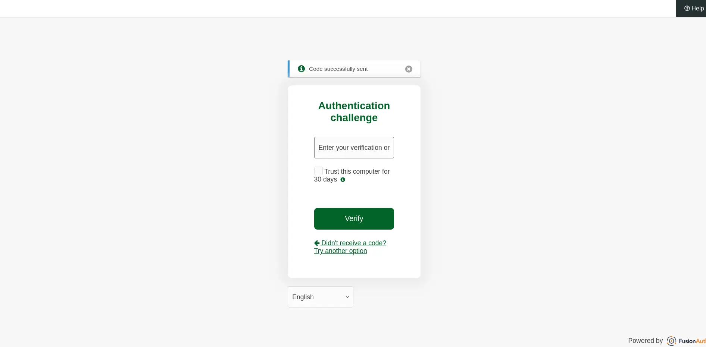


Name: [FusionAuth Default] Two Factor Authentication
Default subject: Your second factor code
```html
<p>
  To complete your login request, enter this one-time code code on the login form when prompted.
</p>
<p>
  <strong>${code}</strong>
</p>

- FusionAuth Admin
```

```text
To complete your login request, enter this one-time code code on the login form when prompted.

${code}

- FusionAuth Admin
```


ERROR https://github.com/FusionAuth/fusionauth-example-kickstart/tree/main/fusionauth/emails

https://github.com/FusionAuth/fusionauth-site/issues/3509


http://localhost:9011/oauth2/authorize?client_id=e9fdb985-9173-4e01-9d73-ac2d60d1dc8e&response_type=code&redirect_uri=http%3A%2F%2Flocalhost%3A3000%2Fauth%2Fcallback


### TOTPs ?


### Passkeys (FIDO2/WebAuthn)​


### Using The FA API

(You can use the API to get a magic link for a user, and send it to them using any mechanism you want instead of email).

TODO examples

### Clean Up
Delete Gmail app password at https://myaccount.google.com/apppasswords
Turn off 2FA at https://myaccount.google.com/security

## Benefits of Passwordless Authentication

1. Stronger Security
    - Reduces the risk of phishing and credential theft.
    - Leverages multi-factor authentication (MFA) principles without requiring
passwords.
2. Improved User Experience
    - Faster logins with fewer steps.
    - No need to remember or reset passwords.
3. Scalability and Flexibility
    - Adapts to various platforms and devices.
    - Supports diverse use cases across B2C, B2B, and internal applications.
4. Compliance Made Easier
    - Helps meet data protection regulations like GDPR by minimizing sensitive data storage.

## Challenges Solved by Passwordless Authentication

1. Credential Theft Mitigation: Protects against phishing, brute force attacks, and credential stuffing.
2. Onboarding Simplification: Removes barriers for new users with seamless registration flows.
3. Improved Accessibility: Enables secure login options for users with disabilities who may struggle with traditional keyboards or password entry.
4. Cost Reduction: Lowers IT support costs related to password management.

## Passwordless Authentication Use Cases

1. Consumer Applications (B2C)
    - E-commerce platforms use magic links for quick logins during checkout.
2. Enterprise Applications (B2B)
    - Employees access corporate tools using biometric authentication or passkeys.
3. Highly Regulated Industries
    - Financial services implement passwordless systems to meet strict security requirements while improving customer satisfaction.
4. IoT Devices
    - Smart home devices use passkeys or mobile-based authentication for secure access without screens or keyboards.

## Types of Passwordless Authentication Solutions

### BY DEPLOYMENT MODEL

- Cloud-Based Solutions Fully managed services hosted in the cloud for quick deployment and scalability.
  - Examples: Auth0, Firebase Authentication
- On-Premises Solutions Self-hosted solutions offering complete control over data and infrastructure.
  - Examples: FusionAuth, Keycloak
- Hybrid Solutions Combine cloud and on-premises features for flexibility.
  - Examples: Ping Identity

### BY FOCUS AREA

- Developer-Centric Solutions Offer APIs and SDKs for easy integration into custom applications.-
  - Examples: FusionAuth, Auth0
- Enterprise-Focused Solutions Prioritize scalability, compliance, and integration with enterprise tools.
  - Examples: Microsoft Azure AD B2C
- Experience-Centric Solutions Emphasize seamless user experiences with customizable workflows.
  - Examples: Okta, Auth0

## Nine Key Features to Look for in a Passwordless Authentication Solution
1. Flexible authentication methods like biometrics, magic links, and passkeys.
2. Self-service account management tools for users to manage preferences independently.
3. Multi-factor authentication (MFA) support for enhanced security layers.
4. Customizable user interfaces that align with brand identity.
5. High availability to handle traffic spikes during peak usage times.
6. Integration points for exporting user data into analytics or compliance tools.
7. Session management features like automatic timeouts for secure sessions.
8. API-first architecture for seamless integration into existing systems.
9. Compliance tools to meet regulations like GDPR or HIPAA.

## Developer's Checklist for Evaluating Passwordless Solutions

- Does the solution support modern standards like WebAuthn or FIDO2?
- Are APIs well-documented and compatible with preferred programming languages?
- Can the solution handle large-scale user bases effectively?
- Is the pricing model transparent and scalable?

## Ready to Go Passwordless?


## TODO
- update light repo with new email templates
- reaplce screenshots with existing ones.
- FA
- add corporate trust Apple/MS/Google to security risks article.
- explain biometric local storage vs master password cloud storage distinction - check with niel. biometrics are for convenience, not security.
- passkeys dont' work in linux. security conscious. programmers and IT professionals. so don't force only passkeys. bitwarden extension or yubikey. same with privacy-orientated phones
- add 2fa email to kickstart online example development json

https://drafts.cc.ritza.co/s/PLzzj797u#


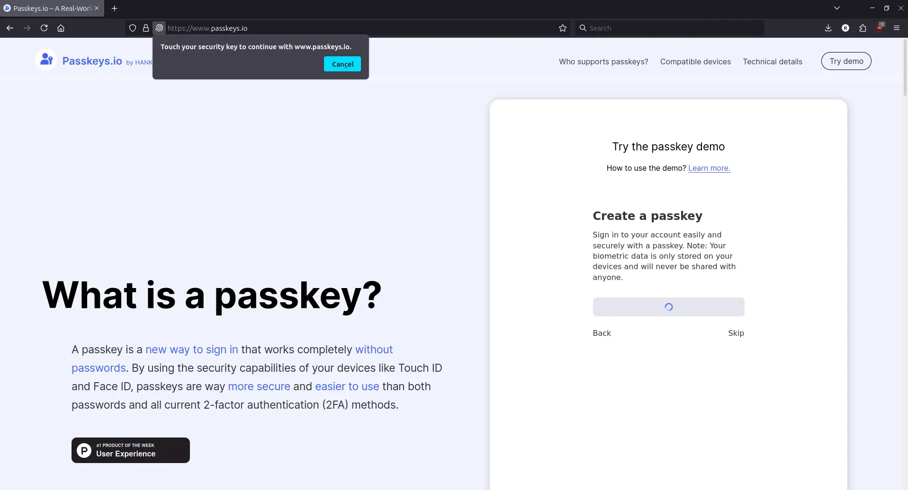


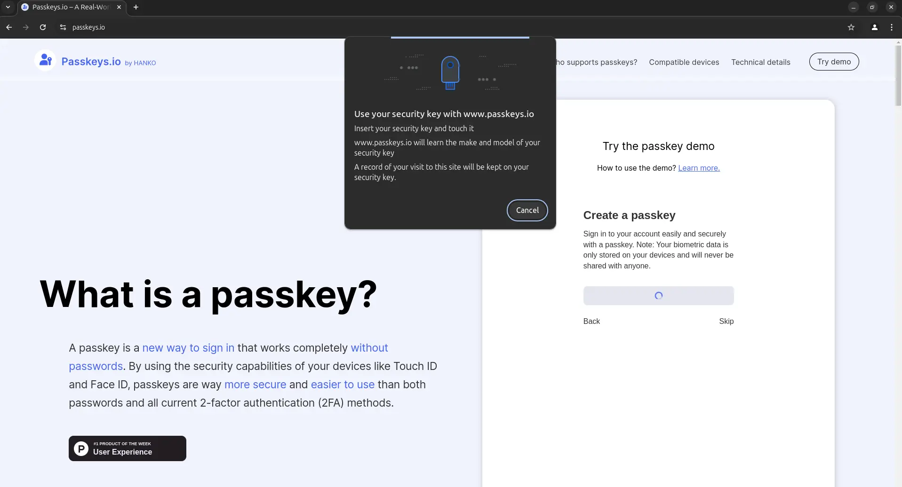


- explain synching
- add explanation of asymmetric keys:

Passkeys use asymmetric keys instead of passwords for several key reasons, which enhance security and convenience:

    Enhanced Security: Asymmetric cryptography involves two keys: a public key that can be shared and a private key that remains confidential. This setup provides several layers of protection:
        Protection against Brute Force Attacks: Since the private key remains hidden and cannot be directly guessed, passkeys are exceedingly difficult to crack through brute force methods[1][2].
        Mitigation of Common Password Vulnerabilities: Passkeys eliminate risks such as easily guessable phrases, reused passwords, and vulnerabilities to dictionary attacks[2][3].
        Non-Repudiation: Asymmetric keys allow for non-repudiation, meaning users cannot deny involvement in a transaction, reducing identity theft and fraud risks[1].

    Secure Storage: The private key is securely stored in a trusted authenticator, eliminating vulnerabilities associated with inadequate storage practices on the client side. This means no more passwords stored in insecure locations like post-it notes or mobile phone contact lists[3].

    Unique Keys: Different passkeys are automatically created for different websites, eliminating the risk of password reuse, reducing susceptibility to credential stuffing, and mitigating the impact of compromised credentials[3].

    No Secrets Sent Over the Internet: Passkeys rely on sending a signed challenge—not the actual private key—to the website during login, ensuring that the private key stays safely on the user’s device without risk of interception[3].

    Improved Database Security: With passkeys, there is no need to store passwords in databases, reducing the risk of password leaks and breaches[3].

    Resistance to Phishing: Passkeys are resistant to phishing attacks because they cannot be typed out or written down and are only valid when used on specific, user-owned devices[4].

In summary, passkeys use asymmetric keys instead of passwords to offer enhanced security, privacy, and convenience, making them a more robust and practical solution for safeguarding digital identities.

{/*  */}