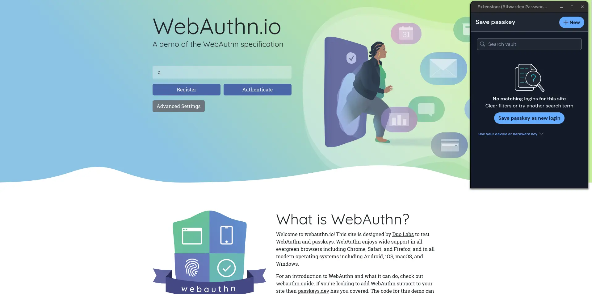
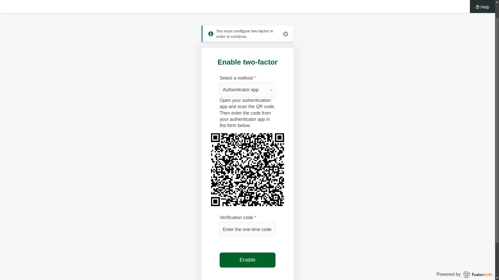
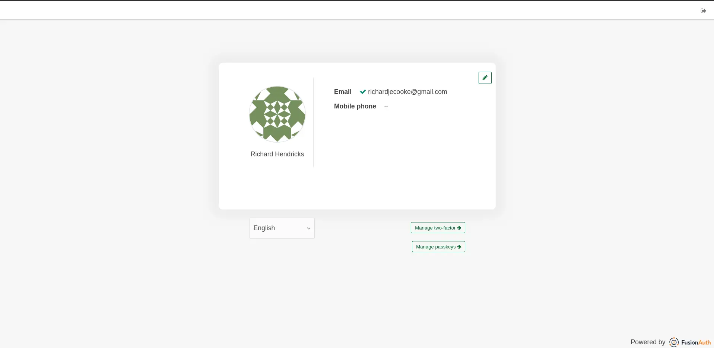
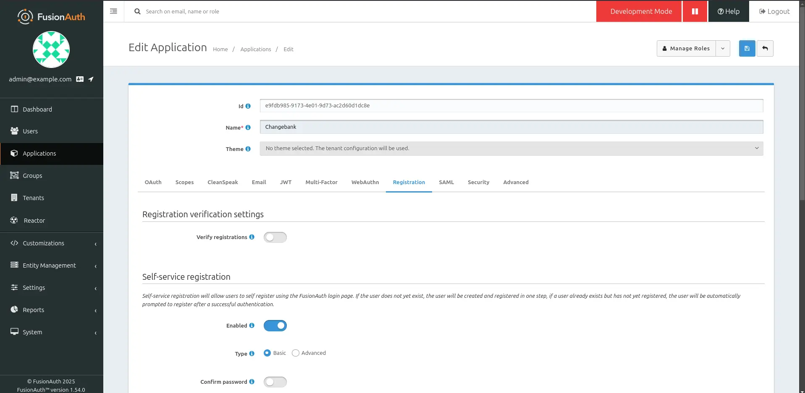
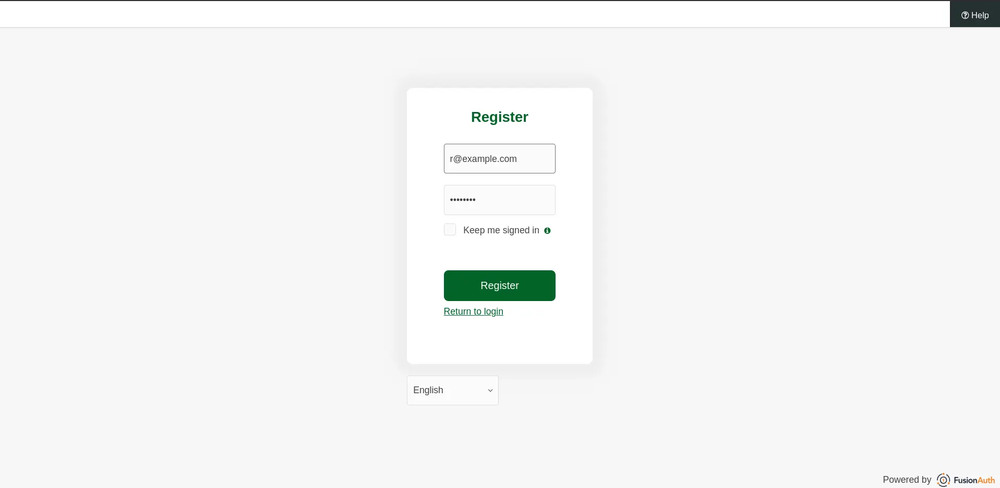
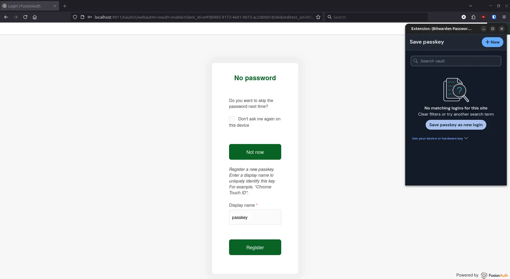
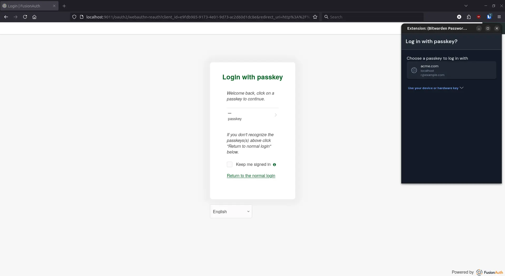
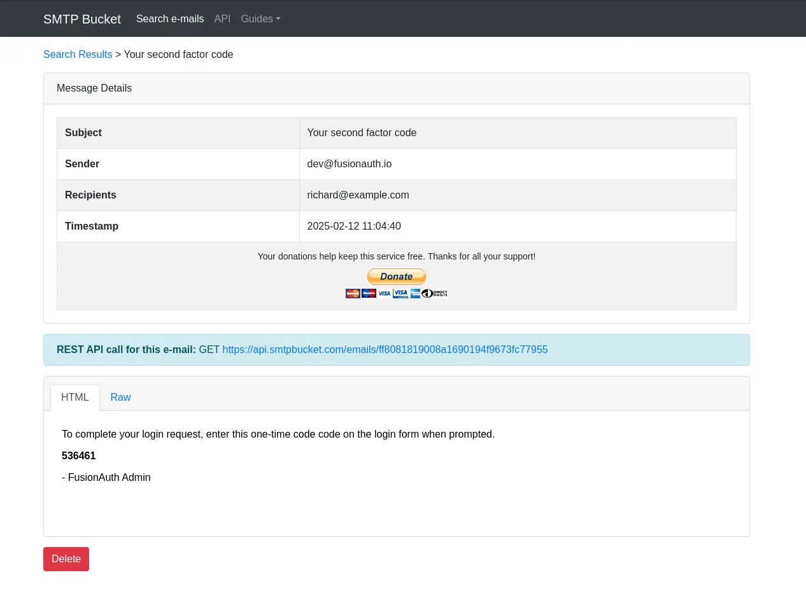
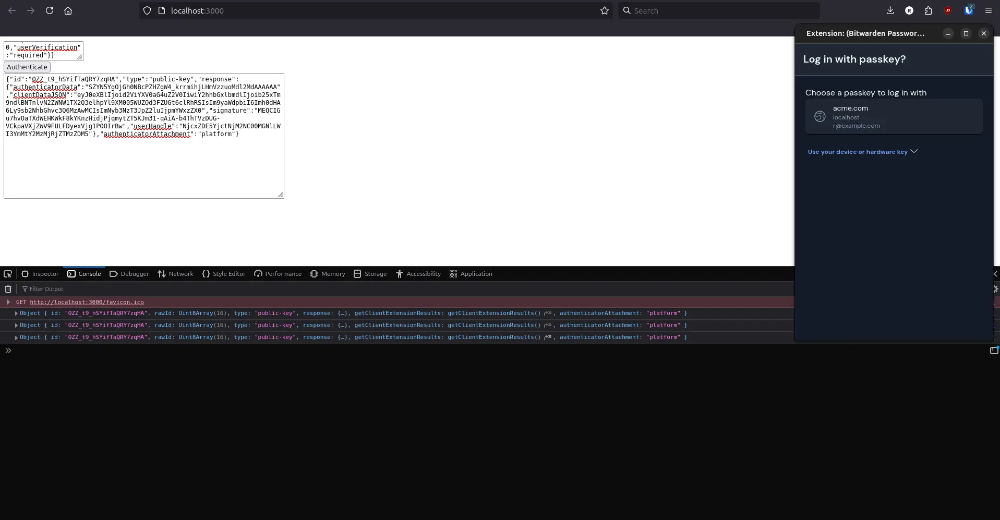

import Aside from 'src/components/Aside.astro';
import Breadcrumb from 'src/components/Breadcrumb.astro';
import InlineUIElement from 'src/components/InlineUIElement.astro';
import InlineField from 'src/components/InlineField.astro';
import StepUpDiagram from 'src/diagrams/docs/lifecycle/authenticate-users/step-up-auth.astro';

- [Introduction](#introduction)
- [What's Wrong With Passwords?](#whats-wrong-with-passwords)
- [What Is Passwordless Authentication?](#what-is-passwordless-authentication)
  - [Passkeys (FIDO2/WebAuthn)​](#passkeys-fido2webauthn)
    - [How Does Passkey Authentication Work?](#how-does-passkey-authentication-work)
    - [How Are Passkeys Managed On And Between Devices?](#how-are-passkeys-managed-on-and-between-devices)
    - [So Passkeys Need A Password?](#so-passkeys-need-a-password)
  - [Magic Links](#magic-links)
  - [One-Time Passwords (OTP)​](#one-time-passwords-otp)
    - [TOTP](#totp)
- [What Are The Benefits Of Passwordless Authentication?](#what-are-the-benefits-of-passwordless-authentication)
  - [Passkeys](#passkeys)
  - [Magic links](#magic-links-1)
  - [MFA](#mfa)
- [What Are The Problems With Passkeys?](#what-are-the-problems-with-passkeys)
  - [Support](#support)
  - [Single Point Of Failure](#single-point-of-failure)
  - [Trust And Familiarity](#trust-and-familiarity)
- [Which Type Of Authentication Should You Use?](#which-type-of-authentication-should-you-use)
- [Implementing Passwordless Options](#implementing-passwordless-options)
  - [Magic Links](#magic-links-2)
  - [One-Time Password (OTP)​](#one-time-password-otp)
  - [Time-Based One-Time Password (TOTP)​](#time-based-one-time-password-totp)
  - [Passkeys (FIDO2/WebAuthn)​](#passkeys-fido2webauthn-1)
  - [Using The FusionAuth API](#using-the-fusionauth-api)
    - [Reauthentication With An OTP](#reauthentication-with-an-otp)
    - [Reauthentication With A Passkey](#reauthentication-with-a-passkey)
- [How To Choose An Authentication Gateway?](#how-to-choose-an-authentication-gateway)
- [Further Reading](#further-reading)


## Introduction

This guide explains the alternatives to traditional username/password login, how and when to use them, and how difficult they are for both users and programmers. By the end of this article, you should be able to answer questions like:

- How exactly is a passkey different from a password, and what is the benefit?
- How do users log in with the same passkey on different devices, and is this portability safe?
- What are these marketing buzzwords, like "magic" links, "frictionless" login, and "biometrics"?
- Should my website use multiple authentication methods or just one, and how do I decide?
- How can I code passwordless authentication, or what tool should I use to implement it for me?

## What's Wrong With Passwords?

If you're conscientious, you might create long random unique passwords for every website, keep them in a password manager, and never share them. The average user doesn't do this. Below are all the difficulties and dangers of passwords as they are commonly used.

- **Inconvenience**: Websites have onerous, differing, requirements to create passwords, and might ask users to change their passwords frequently.
- **Forgetfulness**: Users forget their passwords, especially with multiple accounts.
- **Reuse**: Users reuse the same password for many sites. If one site is hacked, all other accounts are in danger.
- **Lockout**: A user can lose access to their recovery email address, losing their account forever if they forget their password for a website.
- **Guessable**: Weak passwords are easy for hackers to guess or brute-force.
- **Theft**: Even with a strong password, a user can be tricked into revealing a password on a fake website (phishing), by social engineering, physical theft, shoulder-surfing, and key-logging.
- **Breaches**: If hackers gain access to a website database, all customers' passwords are in danger, especially if the website didn't hash the passwords, or hashed them with weak algorithms.
- **Sharing**: Employees in workplaces share passwords, causing security risks (including sabotage), and making auditing and accountability impossible. For paid services like Netflix, sharing passwords also makes fraud between friends easy.

In summary, passwords fail at **convenience** and **security** for non-technical users and companies.

## What Is Passwordless Authentication?

To overcome the problems above, security experts developed the alternatives: passkeys, magic links, and multi-factor authentication (MFA).

This section discusses how these protocols work in theory. Later you'll see what they look like to users, and how to implement them for your website.

### Passkeys (FIDO2/WebAuthn)​

In 2013 the biggest USA software companies formed the FIDO Alliance (**F**ast **ID**entity **O**nline) to "*help reduce the world’s over-reliance on passwords*". Their standard, called FIDO2, was submitted to the World Wide Web Consortium (W3C) and became the WebAuthn standard in 2016. WebAuthn is a protocol that describes how clients and servers can authenticate using asymmetric cryptography (called passkeys here) instead of passwords.

To summarize:
- **FIDO** is both a group of companies and the name of one of their standards.
- **WebAuthn** is the official web standard corresponding to **FIDO2**.
- **Passkeys** are the common name for the private and public keys used to authenticate with **WebAuthn**.

If you need to revise public-key cryptography, see the [Wikipedia page](https://en.wikipedia.org/wiki/Public-key_cryptography). All you need to remember is that there are two keys, and whatever is encrypted with one key can be decrypted only with the other key.

#### How Does Passkey Authentication Work?

Here's how passkey registration on a website works:
- A browser visits a website and the website asks it to register with a passkey.
- The browser creates a new private-public key pair specific to that website and sends the public key to the website, keeping the private key secret.
- The website sends the browser a random string (called a challenge).
- The browser encrypts the string with the private key and sends it back to the website.
- The website verifies the string can be decrypted with the browser's public key.

Passkey sign-in at a later time works the same way: the website sends the browser a random string and checks if the response shows the browser has the private key.

Note the word "browser", not "user". The user does almost nothing in this process, except consent to register or authenticate (this ease is why WebAuthn is said to be "frictionless"). The user doesn't make a password — the browser makes a passkey. So the authentication process is ultimately between a server and a device, not a server and a user.

The user will see something like the screenshot below.



Test passkeys yourself at https://webauthn.io

#### How Are Passkeys Managed On And Between Devices?

You probably have the following questions:
- What exactly is a "device"? A browser? A computer?
- Where are the passkeys kept, and are they secure?
- How does a user log in to the same website from a different device or browser? Or if they lose access to their device?
- How does a user access or change their passkeys?

The last question is the easiest to answer — they don't. Using WebAuthn means a user never directly has access to their own passkeys. Instead, they use a master password to authenticate with their device, and the device generates, encrypts, stores, and synchronizes their passkeys across all the user's devices.

All the questions above can be answered by explaining how the key management works on the client device — which the WebAuthn protocol isn't actually interested in. WebAuthn cares only about the authentication process, but how the client stores the keys is up to them.

The browser itself is not the device, but needs access to a device that can generate and authenticate with public-key cryptography. The device might be built into the hardware and operating system, such as on Android and iOS phones. The device might be an external USB cryptography device (often called a dongle), such as a [Yubikey](https://www.yubico.com/products/yubikey-5-overview). The device might be a browser extension, such as [Bitwarden](https://bitwarden.com). (Note this implies a user is able to choose different devices when authenticating on a site, leading to confusion and inability to log in if they use many different devices).

For ideal security, the private keys would never leave the hardware device. The browser would pass the challenge to the device, which would return the encrypted version and never expose the key. This system existed long before WebAuthn, and is called a hardware security module (HSM). The most famous examples of HSMs are the trusted platform module (TPM), which is required for upgrading to Windows 11, or cryptocurrency wallets, which prevent users accidentally exposing their Bitcoin keys.

For users or banks who want this high level of security, buying a dongle is the answer. However, most users don't want that expense, and want the convenience of being to use the same passkeys on their desktop computer, laptop, tablet, and phone. This means the private keys have to be removed from the secure storage, transferred to an online server, and downloaded to other devices. Microsoft, Apple, and Google provide this functionality in their operating systems. Linux does not. Browser extensions like Bitwarden provide this feature, and have open-source clients.

No matter the provider you use, synchronization works the same way: the passkeys are encrypted with the user's master password, uploaded, stored, and downloaded, where they are decrypted with the user's master password.

#### So Passkeys Need A Password?

So ultimately passkeys are dependent on passwords? What about "biometrics" that people are talking about?

Yes, ultimately the user needs to authenticate with their device using a password, and a password is needed to encrypt all the passkeys for transit (unless you use a dongle). However, a local copy of the passkeys can be stored on the device that are encrypted not with the master password, but with something more convenient, like a short PIN (personal identification number), a fingerprint, or face photograph. And if you lose access to your master password, you lose access to all your passkeys.

So while security companies advertising about biometric security might give you visions of websites doing retinal scans like a sci-fi movie, all it really means is that the user can unlock their phone with their face. It's a bit misleading: WebAuthn doesn't require biometrics. The [specification](https://www.w3.org/TR/webauthn-2) talks about "authentication gestures", which could be a fingerprint or even just a PIN. Biometrics can be used if the user wants, and if their device has the feature. It's more convenience than security.

### Magic Links

A magic link is a unique URL sent to a user in an email. The URL automatically logs the user into a website when browsed to. The link expires after a short time.

Using a magic link means that a user doesn't need a password or a passkey; they need only an email address. The disadvantage is whenever the user's session expires, they will have to request a new link, wait, open their email client, click the link, and delete the email. It's more convenient than a password for most users, unless they frequently log out of sites, or the website sets a very short session duration.

### One-Time Passwords (OTP)​

An OTP is a one-time password or one-time PIN. An OTP can be used in two ways: as an alternative to entering a password, or in addition to entering a password.

The former case is effectively identical to being emailed a magic link for login, except the message is a PIN, not a URL. It's more effort for the user to type in a code than click a link, so there's no reason to use an OTP instead of a magic link.

In the latter case, an OTP is called multi-factor authentication (MFA) or two-factor authentication (2FA). This isn't passwordless authentication, as you still have to enter a password, with the extra effort of entering an OTP too. However, entering an OTP does reduce some security flaws of passwords.

MFA is useful because it proves the user has access to more than one piece of information about themselves, such as email or phone access, increasing the chances they are not an attacker.

#### TOTP

A TOTP (time-based OTP) is similar to an OTP, except instead of being messaged a PIN by the server, the user's phone has an app that shares a secret key with the server. Every thirty seconds the app generates a new PIN the user can type into the server to verify it. A phone is usually required, because the shared secret is often a QR code that has to be photographed. All apps use the same protocol, so the user can choose their favorite.

Since TOTPs don't need to be sent from server to user, they could be used instead of passwords for login, but generally aren't, being used only as a second factor of authentication. TOTPs are also notoriously inconvenient when users change their phone and forget to migrate their authenticator app.

## What Are The Benefits Of Passwordless Authentication?

Let's consider how the three methods — passkeys, magic links, and MFA — solve the password problems listed earlier. This list can be separated into three groups of problems:
1. Inconvenience
1. Forgetfulness, Reuse, Guessable, Breaches, Sharing
1. Theft, Lockout

### Passkeys

Passkeys require almost no effort from the user and, since private keys never leave the device unencrypted, solve the second group of problems too. However, if a user has Google and Apple devices (a phone and tablet), passkeys will not be shared.

Passkeys are still vulnerable to theft — physical theft of a phone, master password, key logging or faking a user's face — and lockout — losing access to a master password or device.

### Magic links

Magic links are convenient and solve all of the group two problems, as long as the user uses a secure email provider and doesn't share their email account with anyone.

Theft and lockout are difficult to prevent. A user's email account suffers all the vulnerabilities of a password, and if stolen, allows an attacker to log in to any website that uses magic links. If a user loses access to their email account, they lose access to all magic link websites.

Passkeys and magic links have almost identical advantages, but passkeys are slightly more convenient. With magic links, a user has a delay between requesting a login and receiving the email. There is also a chance for the website's email provider to be down, or the user's email client to reject the email as spam.

### MFA

Multi-factor authentication is more inconvenient than using a password alone, but generally solves all the group two problems except forgetfulness. Once again, theft and lockout are not solvable with this method.

## What Are The Problems With Passkeys?

If passkeys are endorsed by the software giants, and solve most of the problems of passwords, why do so few sites use them?

### Support

Operating systems may not support passkeys. For instance, most users of Linux and users of older versions of Windows that don't log in to an online account don't have passkey support. Below is the confusing screen you see if you try to use a passkey website on Ubuntu.


Users on these systems may not know how to, or may not want to, enable passkey support.

Browsers themselves have passkey [peculiarities](https://caniuse.com/webauthn) (more [here](https://simplewebauthn.dev/docs/advanced/browser-quirks) and [here](https://passkeys.dev/device-support/)). Safari is fussy and Firefox does not support direct attestations (to avoid fingerprinting browsers and maintain users' privacy) and TouchID (Apple device fingerprint scan).

### Single Point Of Failure

Magic links and passkeys both create a single point of vulnerability for the user — their email address or phone. If an attacker gains access to that, they have access to every site for that user. Phone theft has increased significantly in recent years (and kidnapping in high-crime countries), due to the high reward of gaining access to mobile banking apps and TOTP authenticator apps, which is ironically what banks have been promoting for increased security.

Similarly, if a user loses access to their master password and recovery codes, they are locked out of every account.

In contrast, if a user uses different passwords for every site, an attacker gaining access to one site gains no access to any other. Forgetting a password for one site doesn't lock you out of all others.

### Trust And Familiarity

Passwords are instantly intuitive to most people — they're like a door key. In contrast, passkeys are impossible to explain to a non-technical user. And they've been around only for the last few years.

You need to convince your users that they can log in to your site with some new invisible technology, that logging in without entering a password is completely secure, and that they won't lose access.

Finally, users need to trust Google, Apple, and Microsoft with storing their passkeys to every site they use. These companies may claim that they transmit and store private keys with encryption, but since their code is not open-source, users can never know for sure. Further, if your country is hit with US sanctions and you lose cloud access, you lose access to all your keys. Using a dongle or open-source provider like Bitwarden can prevent this.

## Which Type Of Authentication Should You Use?

So given all the types of authentication and their advantages and disadvantages, which should you use?

Firstly, if you are stuck with using passwords, choose sensible password restrictions with a framework like [zxcvbn](https://github.com/dropbox/zxcvbn). Rules like "must contain uppercase, lowercase, a number, and special characters" are antiquated, annoying, and still not secure. Provide links on your registration page to password managers to educate users on secure practices.

If your site is dangerous (banking or medical), require your users to use MFA. Provide them a choice of delivery options to be as convenient as possible, such as email, SMS, WhatsApp, or TOTP.

If you don't have to use passwords, for public websites you should always use magic links instead. Passwords offer almost no advantages. Choosing between magic links and passkeys is more difficult. If possible, provide both options to users to support those who may not be able or willing to use passkeys. Magic links rely on email, which has more security risks (especially of interception) than passkeys, so for industries needing extreme security, rather choose passkeys.

If you want to use only passkeys, you should provide a brief explanation of what they are on your registration page, as well as explain to users the devices they can use, and how they can synchronize their passkeys to other computers.

Passkeys are a good choice when you have users using known equipment, such as a corporation where all employees use Windows 11 with TPM hardware and a Microsoft account.

There are some use cases where specific authentication methods are required. For devices without keyboards (TVs, fridges, and cars), passkeys are a good option. Highly regulated industries, such as banking and large corporations, might require passkeys.

For extreme cases of life and death, like pacemakers or aircraft security, you need to balance the extra security of passkeys, with the need to grant urgent access in an emergency (which is easier with a password), with the possibility of account lockout if keys are lost.

## Implementing Passwordless Options

Now that you know the theory of various authentication methods, let's see what they look in practice from the user's point of view, and how difficult they are to implement.

While you can code authentication yourself, it's much safer and faster to use a dedicated authentication gateway or framework. This section will show you examples of authentication using a tool called FusionAuth, but you can use similar configuration using software like Ory, Keycloak, Auth0, and others.

FusionAuth, like most of these tools, provides login screens for users, a separate administrative web portal, and an API so that your website can create custom screens that use the authentication system programmatically.

<Aside type="tip">
If you want to test the examples yourself, you'll need an installation of FusionAuth. The easiest way to run FusionAuth is in a Docker container. Clone the example GitHub repository [here](https://github.com/fusionauth/fusionauth-example-docker-compose). Open a terminal in the `light` subdirectory, and run `docker compose up` in a terminal to start FusionAuth. Log in at http://localhost:9011 with `admin@example.com` and `password`.

Using passkeys requires [a free community license](https://fusionauth.io/docs/get-started/core-concepts/plans-features). Some advanced features might require a paid license.
</Aside>

### Magic Links

You can configure FusionAuth to allow a user to log in with magic links in addition to, or as an alternative to, username and password authentication.

Log in to FusionAuth and in the <Breadcrumb>Tenants</Breadcrumb> page, edit the default tenant. In the <Breadcrumb>Email</Breadcrumb> tab, set the <InlineField>Host</InlineField> to `mail.smtpbucket.com` and the <InlineField>Port</InlineField> to `8025`. [SMTPBucket](https://www.smtpbucket.com) is a free online mail testing service. To configure other email providers for a real service, follow the [SMTP guide](https://fusionauth.io/docs/customize/email-and-messages).

To configure magic links, follow the [guide](https://fusionauth.io/docs/lifecycle/authenticate-users/passwordless/magic-links). In brief, you need to ensure that you have an email template ready to send the user (which was done for you in the [Kickstart file of the repository](https://github.com/fusionauth/fusionauth-example-docker-compose/blob/main/light/kickstart/kickstart.json) you downloaded) and enable passwordless login in the security tab of the application settings (an application is the FusionAuth name for a group of users and how they are allowed to log in).


Email templates can be customized in the tenant (a group of FusionAuth users and applications), so you can format your magic links and their accompanying message how you want.


Finally, you need to have a user to test the login. This demonstration application already has a user with email `richard@example.com`.

In reality, your website's login page would redirect to a FusionAuth login page, but FusionAuth also provides a standalone login page that requires no client website. On the applications page, select <InlineField>View</InlineField> to see more details about the application, including the test OAuth login page, which will be available at http://localhost:9011/oauth2/authorize?client_id=e9fdb985-9173-4e01-9d73-ac2d60d1dc8e&response_type=code&redirect_uri=http%3A%2F%2Flocalhost%3A3000%2Fauth%2Fcallback.

You'll see that the page has a magic link option.


If you enter your email address and click the button a login URL will be emailed to you.


Clicking this link will log you in to FusionAuth and redirect you to the website that called it (which doesn't exist since this is just a test).

More information on magic links in FusionAuth is available [here](https://fusionauth.io/docs/lifecycle/authenticate-users/passwordless/magic-links).

### One-Time Password (OTP)​

An OTP can be used in two ways: as an alternative to entering a password, or as MFA. FusionAuth doesn't support the former case.

To configure MFA, follow the [guide](https://fusionauth.io/docs/lifecycle/authenticate-users/multi-factor-authentication). In brief, you need to enable email in your tenant multi-factor tab and set multi-factor login policy to `required` for your application.


Now when a user logs in, they will be asked to configure MFA. In this example, you can choose email authentication. Log in at the same [URL](http://localhost:9011/oauth2/authorize?client_id=e9fdb985-9173-4e01-9d73-ac2d60d1dc8e&response_type=code&redirect_uri=http%3A%2F%2Flocalhost%3A3000%2Fauth%2Fcallback) as the previous example.


You'll receive a password via email.


After logging in, you'll be able to save recovery codes in case you lose access to your email account.


Now that email authentication is configured, the MFA login will be simpler in future.


### Time-Based One-Time Password (TOTP)​

The TOTP setup process, and user authentication flow, is almost identical to an OTP. The user enters an OTP on the FusionAuth login page from the TOTP app on their phone.



Follow the [guide](https://fusionauth.io/docs/lifecycle/authenticate-users/multi-factor-authentication) to enable TOTP. Unlike for OTP and magic links, you won't need to use any email templates.

### Passkeys (FIDO2/WebAuthn)​

Configure passkeys using the [guide](https://fusionauth.io/docs/lifecycle/authenticate-users/passwordless/webauthn-passkeys). In brief, you need only enable them in the WebAuthn tab of the tenant, including the bootstrap and reaauthentication protocols (for creating and reusing passkeys). Like all other authentication options you've seen so far, you can override tenant settings for different applications.


Now when you browse to the [application login page](http://localhost:9011/oauth2/authorize?client_id=e9fdb985-9173-4e01-9d73-ac2d60d1dc8e&response_type=code&redirect_uri=http%3A%2F%2Flocalhost%3A3000%2Fauth%2Fcallback), you'll see there is an option to log in with fingerprint or device (i.e. passkey) for richard@example.com.


However, you'll see that no passkeys are found on your device. This is because you can't use passkeys in FusionAuth without setting them up first: either when a user first registers, or in the FusionAuth self-service account page.


You will need to direct your existing users to the self-service account management page to create a passkey, which can be found on the <Breadcrumb>Application -> View</Breadcrumb> page in FusionAuth. In this localhost example, the self-service page is [here](http://localhost:9011/account/?client_id=e9fdb985-9173-4e01-9d73-ac2d60d1dc8e).



The user registration URL for localhost can be found in the same way. It's [here](http://localhost:9011/oauth2/register?client_id=e9fdb985-9173-4e01-9d73-ac2d60d1dc8e&response_type=code&redirect_uri=http%3A%2F%2Flocalhost%3A3000%2Fauth%2Fcallback). But first, you have to enable self-service registration for any user in the application settings (as opposed to having an administrator enter users' email addresses and sending them invitations).



Now you, as a user, can browse to the [registration URL](http://localhost:9011/oauth2/register?client_id=e9fdb985-9173-4e01-9d73-ac2d60d1dc8e&response_type=code&redirect_uri=http%3A%2F%2Flocalhost%3A3000%2Fauth%2Fcallback) and register with any email address and password you want. (For testing purposes, it's faster if you as the administrator disabled verifying email addresses in the application settings).



On the next page of the registration you can choose to create passkeys.



After these steps are done, you can [log in](http://localhost:9011/oauth2/authorize?client_id=e9fdb985-9173-4e01-9d73-ac2d60d1dc8e&response_type=code&redirect_uri=http%3A%2F%2Flocalhost%3A3000%2Fauth%2Fcallback) with your passkey in future.



<Aside type="danger">
As you probably noticed, your new user still had to enter a password at registration. This is because FusionAuth doesn't yet offer a fully passwordless user experience. There is an open [Github issue](https://github.com/FusionAuth/fusionauth-issues/issues/484) for this feature since 2020. If avoiding passwords entirely is important to you, please vote and comment on this issue to increase its priority for the FusionAuth programmers.
</Aside>

### Using The FusionAuth API

You can use the FusionAuth API to programmatically perform the same login tasks the user performed using the login screens. For example, even though you can style the FusionAuth login pages to match your website, you could create a highly extremely custom login page that is built into your existing website if you use the API. Instead of the user entering credentials on the FusionAuth login page, the user would enter them on your website, which forwards the credentials to FusionAuth.

A more common use-case than logging in, is to ask the user to securely confirm a decision by reauthenticating themselves. For example, when making a purchase on your site.

This is one time when having a more onerous authentication flow is preferable to a faster one. For example, assume a user's child is playing on their parent's computer and is trying to buy something without permission. If the user relies on passkeys, the child can click the passkey in the desktop browser when it pops up. If the user instead uses SMS OTPs, or a TOTP on their phone, it would be much more difficult for the child. Passkeys could be made more secure by the user enabling the browser setting to enter a PIN before accessing the passkey vault. This relies on the user to set up, and is not something your website or FusionAuth can enforce.

Let's take a quick look at what an API call would look like for an OTP request or passkey authentication request from your website to FusionAuth.

#### Reauthentication With An OTP

For an OTP (MFA), FusionAuth calls reauthentication "Step up auth", which is documented [here](https://fusionauth.io/docs/lifecycle/authenticate-users/multi-factor-authentication#step-up-auth).

<StepUpDiagram alt="Diagram of step up auth when user selects a message based MFA method like email." />

Start the MFA process using the curl command below, specifying for which user and application you want to generate an OTP. (In a real application, you could use any programming language instead of curl).

```sh
curl 'http://localhost:9011/api/two-factor/start' \
-H 'Authorization: 33052c8a-c283-4e96-9d2a-eb1215c69f8f-not-for-prod' \
-H 'Content-Type: application/json' \
-d '{
  "applicationId": "e9fdb985-9173-4e01-9d73-ac2d60d1dc8e",
  "loginId": "richard@example.com",
  "method": "email",
  "state": { "transaction": "pending" }
}'


# RESPONSE:
# {"code":"480408","methods":[],"twoFactorId":"XFb2zBIKB5PoA7ZdZA_A3TjfVPm6fMhD_ypl7axBvyE"}
```

The response above contains the code (OTP) that the user will be challenged to enter. You need to ask the user to enter this code on your website. The two factor Id is a field that you use in subsequent FusionAuth calls to remember what MFA transaction you're busy with.

Next, ask FusionAuth to send the OTP to the user's email. You specify only the two factor Id, not the code itself.

```sh
curl 'http://localhost:9011/api/two-factor/send' \
-H 'Authorization: 33052c8a-c283-4e96-9d2a-eb1215c69f8f-not-for-prod' \
-H 'Content-Type: application/json' \
-d '{
  "email": "richard@example.com",
  "method": "email",
  "userId": "00000000-0000-0000-0000-111111111111",
  "twoFactorId": "XFb2zBIKB5PoA7ZdZA_A3TjfVPm6fMhD_ypl7axBvyE"
}'
```

The user will receive an email with the OTP.



Once the user enters this code on your website, you can complete the authentication by verifying the code with FusionAuth.

```sh
curl POST 'http://localhost:9011/api/two-factor/login' \
-H 'Authorization: 33052c8a-c283-4e96-9d2a-eb1215c69f8f-not-for-prod' \
-H 'Content-Type: application/json' \
-d '{
  "code": "480408",
  "twoFactorId": "XFb2zBIKB5PoA7ZdZA_A3TjfVPm6fMhD_ypl7axBvyE"
}'
```

All you need to check in this response is the success code 200. You can ignore the JSON returned.

If the code expired no JSON will be returned, but the HTML response will be a 404 (not found). Use `curl -v` to see this extra information. Response 421 indicates the code was invalid.

<Aside type="tip">
If you're trying to test the commands above yourself, but can't complete all the steps before the token expires, you can ignore the middle email step, and instead copy the code directly from the first command into the final, verification, command.
</Aside>

<Aside type="caution">
You might be wondering why you need to call FusionAuth to check if the code the user entered was correct in the final step, when you already have the code from the first command's reponse, and your website can compare the two codes itself. There are two reasons:
1. FusionAuth automatically handles rejecting expiring codes, so your website doesn't need to implement a timer.
2. You don't have to store the code in server session state in order to check it later. FusionAuth handles remembering the code for you, by associating everything with the two factor Id.
</Aside>

#### Reauthentication With A Passkey

This final example shows how to ask for confirmation from a user using their passkey instead of a OTP. It uses the [SimpleWebauthn TypeScript library](https://simplewebauthn.dev/docs).

You'll need to have a new user that is registered to use passkeys, so you can reuse the user you create in the passkey example earlier. This example uses `r@example.com` with Id `671d19b7-6364-40ce-b7bc-cc324ce33d39`, so change these values to match yours.

In any directory on your computer, create a page called `index.html` and insert the code below.

```html
<!DOCTYPE html>
<html lang="en">
<head>
    <meta charset="UTF-8">
    <meta name="viewport" content="width=device-width, initial-scale=1.0">
    <title>FusionAuth passkey test</title>
    <script src="https://unpkg.com/@simplewebauthn/browser@13.1.0/dist/bundle/index.umd.min.js"></script>
</head>
<body>
    <textarea id="input"></textarea><br />
    <button onclick="authenticate()">Authenticate</button><br />
    <textarea id="output"></textarea>

    <script>
      async function authenticate() {
        // get passkey from FusionAuth data
        console.clear();
        const input = document.getElementById("input").value;
        let json = JSON.parse(input);
        const bts = SimpleWebAuthnBrowser.base64URLStringToBuffer;
        json.options.challenge              = bts(json.options.challenge);
        json.options.allowCredentials[0].id = bts(json.options.allowCredentials[0].id);
        const { 'options': publicKey, ...rest } = json;
        json = { publicKey, ...rest };
        const passkey = await navigator.credentials.get(json);

        // convert passkey to JSON
        console.log('Passkey:');
        console.dir(passkey);
        const stb = SimpleWebAuthnBrowser.bufferToBase64URLString;
        passkey.response.authenticatorData = stb(passkey.response.authenticatorData);
        passkey.response.clientDataJSON    = stb(passkey.response.clientDataJSON);
        passkey.response.signature         = stb(passkey.response.signature);
        passkey.response.userHandle        = stb(passkey.response.userHandle);
        delete(passkey.getClientExtensionResults);
        delete(passkey.rawId);
        const result = {
          'origin': 'http://localhost:3000',
          'rpId': 'localhost',
          'credential': { ...passkey }
        };
        document.getElementById("output").value = JSON.stringify({ ...result });
      }
    </script>
</body>
</html>
```

This page has an input textbox, an output textbox, and a button that runs code to take the inputted JSON, ask the user to enter the passkey for the JSON, and outputs the passkey as JSON. To understand how it all works in detail, see the complete [guide](https://fusionauth.io/docs/lifecycle/authenticate-users/passwordless/webauthn-passkeys#authentication-2).

Open a terminal in the HTML directory and run the command below to serve the page at http://localhost:3000 using Docker.

```sh
docker run --rm --network faNetwork -v .:/app -w /app -p 3000:4507 denoland/deno:latest run --allow-sys --allow-net --allow-read https://deno.land/std/http/file_server.ts /app
```

Start the passkey reauthentication process using the curl command below. You might need to replace the `userId` value with the value of the user you created to test with.

```sh
echo && curl -w '\n\n' 'http://localhost:9011/api/webauthn/start' \
-H 'Authorization: 33052c8a-c283-4e96-9d2a-eb1215c69f8f-not-for-prod' \
-H 'Content-Type: application/json' \
-d '{
  "applicationId": "e9fdb985-9173-4e01-9d73-ac2d60d1dc8e",
  "userId": "671d19b7-6364-40ce-b7bc-cc324ce33d39",
  "workflow": "reauthentication"
}'

# RESPONSE
# {
# 	"options": {
# 		"allowCredentials": [
# 			{
# 				"id": "OZZ_t9_hSYifTaQRY7zqHA",
# 				"transports": [ "internal" ],
# 				"type": "public-key"
# 			}
# 		],
# 		"challenge": "jbwImkaXKarROwdtFUHpbtYCN3QirwMNnPwih5xWi_Y",
# 		"timeout": 180000,
# 		"userVerification": "required"
# 	}
# }
```

Paste the curl JSON response into the textbox at the top of the page at http://localhost:3000 and click <InlineUIElement>Authenticate</InlineUIElement>. Authorize the request to access your passkey in the browser popup.



<Aside type="tip">
If your browser reports a generic DOM error in the browser console that access to passkeys is not allowed, it's probably not a permissions error. The error is likely due to incorrectly formatted JSON (which you can see using a `console.log` statement in the JavaScript code. This example was tested on Firefox. If you're using a different browser, check its documentation to see what it requires in a `navigator.credentials.get()` request, and check if the browser has any quirks [here](https://simplewebauthn.dev/docs/advanced/browser-quirks).

In Firefox, you might need to browse to `about:config`, search for `webauthn` and enable all settings, but the default settings should allow passkeys.

Note also that you don't need to change the relying party Id, despite using both localhost:9011 and localhost:3000, because cookies separate domains using ports, but Webauthn does not.
</Aside>

Copy the text that appears in the lower textbox, paste it between the `'` quotes at the end of the command below after `-d`, overwriting the example payload shown, and run the command.

```sh
echo && curl -w '\n\n' 'http://localhost:9011/api/webauthn/assert' \
-H 'Authorization: 33052c8a-c283-4e96-9d2a-eb1215c69f8f-not-for-prod' \
-H 'Content-Type: application/json' \
-d '{"origin":"http://localhost:3000","rpId":"localhost","credential":{"id":"OZZ_t9_hSYifTaQRY7zqHA","type":"public-key","response":{"authenticatorData":"SZYN5YgOjGh0NBcPZHZgW4_krrmihjLHmVzzuoMdl2MdAAAAAA","clientDataJSON":"eyJ0eXBlIjoid2ViYXV0aG4uZ2V0IiwiY2hhbGxlbmdlIjoiamJ3SW1rYVhLYXJST3dkdEZVSHBidFlDTjNRaXJ3TU5uUHdpaDV4V2lfWSIsIm9yaWdpbiI6Imh0dHA6Ly9sb2NhbGhvc3Q6MzAwMCIsImNyb3NzT3JpZ2luIjpmYWxzZX0","signature":"MEYCIQD2-ZC9kTcI5stHY-eii4yoZbu_r0vG5bEiyPB9OcrQXwIhANblFrkPgKFoaI3ysm9GlU6XxwDIhbmaabuZ3UPIz6Wj","userHandle":"NjcxZDE5YjctNjM2NC00MGNlLWI3YmMtY2MzMjRjZTMzZDM5"},"authenticatorAttachment":"platform"}}'

# RESPONSE

# {
# 	"credential": {
# 		"algorithm": -7,
# 		"attestationType": "none",
# 		"authenticatorSupportsUserVerification": true,
# 		"credentialId": "OZZ_t9_hSYifTaQRY7zqHA",
# 		"data": {},
# 		"discoverable": false,
# 		"displayName": "passkey",
# 		"id": "50398a84-1d25-4bec-b87a-dafaae56702d",
# 		"insertInstant": 1739354896368,
# 		"lastUseInstant": 1739790906822,
# 		"name": "r@example.com",
# 		"publicKey": "-----BEGIN PUBLIC KEY-----\nMFkwEwYHKoZIzj0CAQYIKoZIzj0DAQcDQgAELgV+MzwRuHh/h/js5jwO1BCGCDph\n5spWR+JYfY9J6iUEvO2AwOlnq9WtLoocvo7u1pW1wEwD9rs4RO96z+C4Tg==\n-----END PUBLIC KEY-----",
# 		"relyingPartyId": "localhost",
# 		"signCount": 0,
# 		"tenantId": "d7d09513-a3f5-401c-9685-34ab6c552453",
# 		"transports": [
# 			"internal"
# 		],
# 		"userAgent": "Mozilla/5.0 (X11; Linux x86_64; rv:135.0) Gecko/20100101 Firefox/135.0",
# 		"userId": "671d19b7-6364-40ce-b7bc-cc324ce33d39"
# 	}
# }
```

The JSON above confirms that the user's passkey authentication is correct, and you can let them continue with whatever transaction they wanted to do. As long as the API response returns code 200 and has no errors, the user has been verified successfully.

<Aside type="caution">
If you don't run all the commands fast enough, your authentication request might time out. If any part of your JSON is incorrect, FusionAuth will give you the vague error message:
`{"fieldErrors":{},"generalErrors":[{"code":"[Exception]","message":"FusionAuth encountered an unexpected error. Please review the troubleshooting guide found in the documentation for assistance and the available support channels."}]}`. To find the problem, you will need to compare the JSON you are sending to the FusionAuth [API specification](https://fusionauth.io/docs/apis/webauthn#complete-a-webauthn-passkey-assertion), and to the expected [example JSON parameter](https://fusionauth.io/docs/lifecycle/authenticate-users/passwordless/webauthn-passkeys#completing-the-assertion), manually.
</Aside>

## How To Choose An Authentication Gateway?

In the previous section, you saw that configuring complex technologies, like WebAuthn and TOTPs, takes only a few button clicks using an authentication gateway. But there are so many gateways available, how do you choose?

If you are using only the basic features of a gateway, without API integration, don't worry, just a pick gateway that looks decent and point your website login to it. It's generally easy to migrate your user emails from one gateway to another.

But if you're using deep integration, you need to consider cost, feature set, ease of use, reliability, support, documentation, customization, and hosting possibilities. FusionAuth has detailed comparison articles on different gateways [here](https://fusionauth.io/blog/category/compare/).

Here are a few basics to consider:
- **Deployment model**: Is the gateway cloud-only (fully online), self-hosted, or hybrid? Generally the paid gateways are cloud, where the gateways that are open-source, or have free tiers, have self-hosting options. Online managed solutions are quick to setup, but might be less customizable and more costly than hybrid or self-hosted tools.
- **Focus area**: Does the gateway focus on developer usability, offering APIs and SDKs for easy integration; enterprise usability, prioritizing scalability, compliance, and integration with corporate tools; or end-user usability, prioritizing elegant user experiences with customizable workflows?
- **Features**: Does the gateway offer all the passwordless options discussed in this article, and are they easy to configure?
- **Scalability**: Can the gateway handle your number users, including usage spikes at peak times?
- **Compliance**: Do you need the gateway to be legally compliant with any rules in your industry or country, like GDPR or HIPAA?

## Further Reading

Below are all the links mentioned in this guide if you'd like to learn more.

- [WebAuthn specification](https://www.w3.org/TR/webauthn-2)
- [WebAuthn browser API](https://developer.mozilla.org/en-US/docs/Web/API/Web_Authentication_API#webauthn_concepts_and_usage)
- [WebAuthn browser compatibility](https://caniuse.com/webauthn)
- [WebAuthn browser quirks](https://simplewebauthn.dev/docs/advanced/browser-quirks)
- [WebAuthn device compatibility](https://passkeys.dev/device-support)
- [Public key cryptography](https://en.wikipedia.org/wiki/Public-key_cryptography)
- [Bitwarden password manager](https://bitwarden.com)
- [Yubikey passkey dongle](https://www.yubico.com/products/yubikey-5-overview)
- [SimpleWebAuthn JS library](https://jsr.io/@simplewebauthn/browser/doc)
- [zxcvbn password strength library](https://github.com/dropbox/zxcvbn)
- [FusionAuth documentation on passwordless authentication](https://fusionauth.io/docs/lifecycle/authenticate-users/passwordless/)
- [FusionAuth gateway comparisons](https://fusionauth.io/blog/category/compare)
- [FusionAuth gateway migration guides](https://fusionauth.io/docs/lifecycle/migrate-users/general-migration)