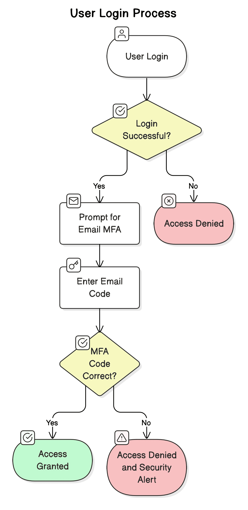
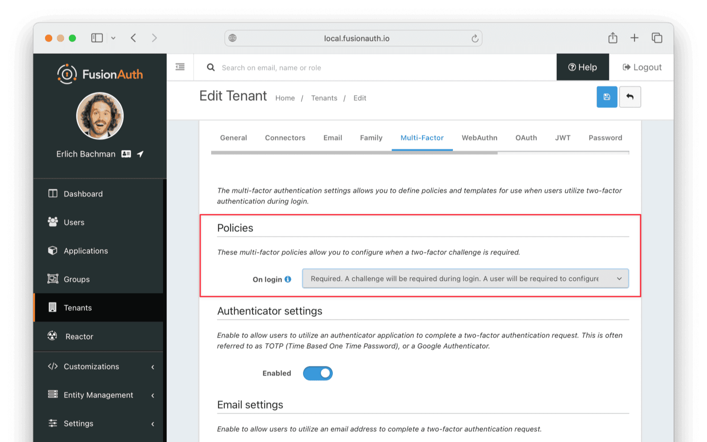
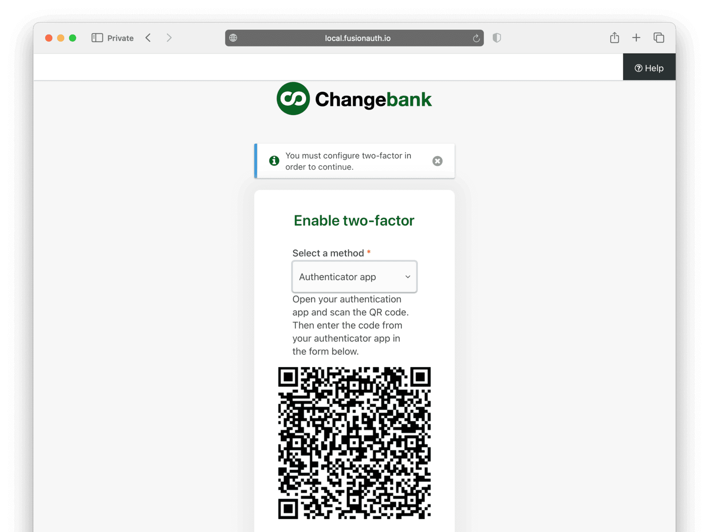
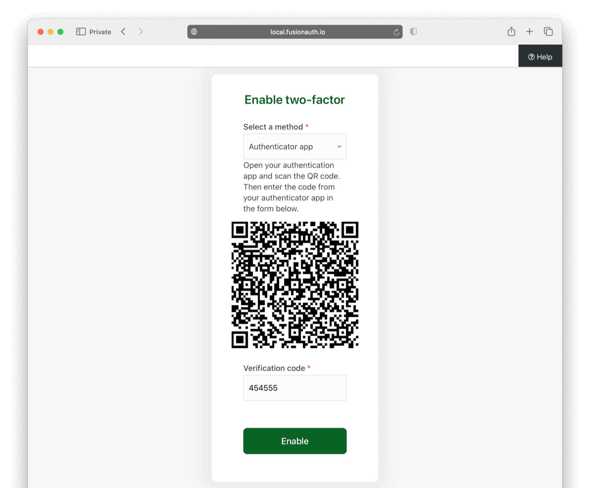
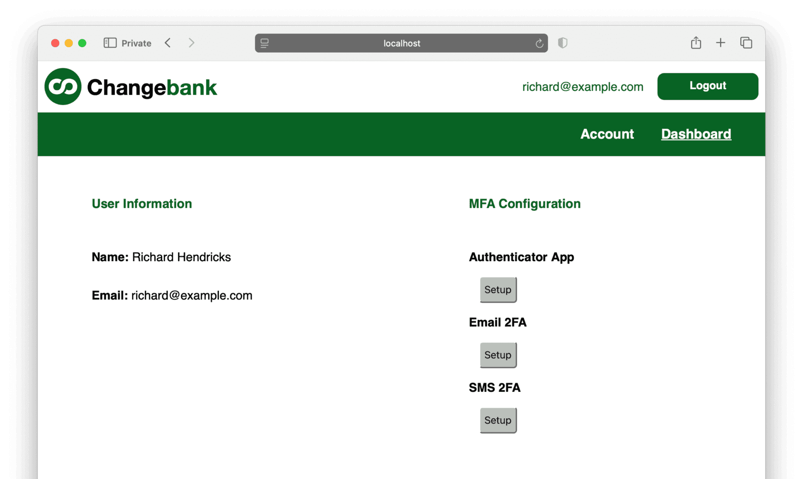
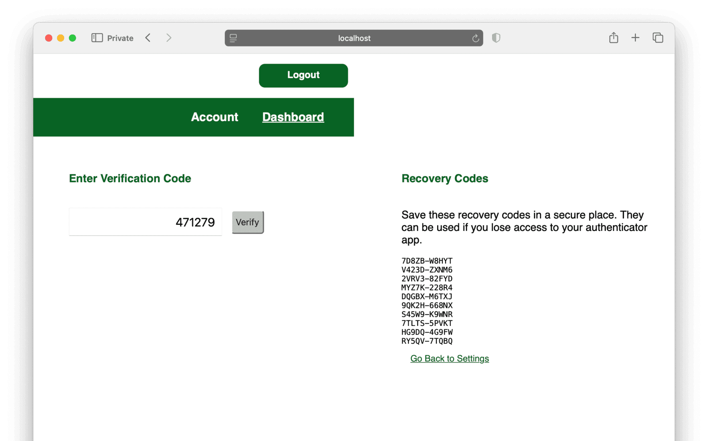
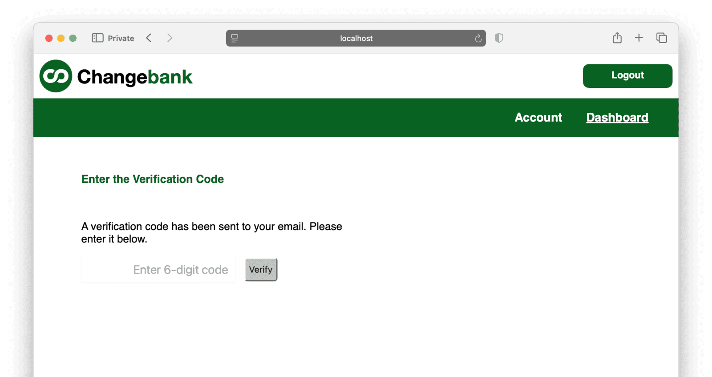

Cyberattacks are becoming more frequent, yet [nearly 90%](https://www.securitymagazine.com/articles/100339-88-of-organizations-use-passwords-as-primary-authentication-method) of businesses still rely solely on passwords, which is not enough. The consequences are severe—[47% of breached businesses in 2023 lacked MFA protection](https://keepnetlabs.com/blog/understanding-mfa-phishing-protection-measures-and-key-statistics). But despite its benefits, MFA is often seen as complicated to implement.

Integrating MFA doesn't have to be an arduous task. Businesses can adopt strong authentication without unnecessary complexity by understanding how MFA works and the common implementation challenges.

This guide will demystify MFA by exploring how it works, the authentication flow, the difficulties of implementation, and how you can integrate MFA into your application using FusionAuth smoothly.

## Why is MFA complicated?

MFA is one of the most effective ways to protect user accounts, but many businesses hesitate to implement it despite its security benefits. While some industries enforce MFA due to regulatory requirements, many companies still rely on passwords alone, exposing themselves to security risks. This is often due to:

- Lack of Awareness and Understanding: Over [55% of small business owners don't know the benefits of MFA, and 47% of IT decision-makers don't understand how it works](https://cyberreadinessinstitute.org/news-and-events/global-small-and-medium-sized-businesses-slow-to-move-to-more-secure-multi-factor-authentication-account-access-method-new-cyber-readiness-institute-survey-finds/#:~:text=MFA%20has%20been,with%20their%20employees.). Without this knowledge, businesses fail to prioritize it.
- Login Friction and User Resistance: Extra authentication steps can frustrate users, which leads to higher churn rates, fewer conversions, and lost revenue.
- Technical Complexity: Basic MFAs like SMS and email OTPs are easy to implement, but integrating TOTP, biometrics, or push notifications across multiple platforms makes implementation difficult. Developers spend time on security instead of building features.
- Cost and Resource Concerns: SMS-based MFA requires third-party providers, compliance fees, and infrastructure costs. Companies fear these expenses outweigh the benefits.
- Too Many Choices, Making MFA Selection Difficult: Businesses must decide between cloud-based, self-hosted, or hybrid MFA solutions and whether they need developer-friendly APIs or enterprise compliance tools. This complexity delays adoption.

MFA should be simple to implement. If it feels complicated, the issue isn't MFA but the providers. Poorly designed MFA solutions create friction and unnecessary costs, causing businesses to avoid the security they actually need.

FusionAuth provides a flexible and developer-friendly MFA solution. Whether using the admin UI or API, businesses can integrate TOTP, email, SMS, and WebAuthn authentication in minutes.

## What is MFA?

MFA operates on a simple premise: a password alone is not enough. To strengthen authentication, an extra step is required to verify an identity. This is commonly referred to as two-factor authentication (2FA), where a user provides both a password and a second factor (OTP code) before gaining access.

Multi-factor authentication (MFA) extends this principle. Instead of relying on just one factor, MFA requires at least two factors to authenticate a user.

For example, a login process including MFA may involve:

- Entering a password.
- Entering a one-time code from an authenticator app.
- Providing biometric verification, such as a fingerprint scan.

To understand how MFA works, let's define a factor. A factor in authentication is a distinct piece of information used to verify an identity. It is categorized as:

1. **Something You Know** – A secret that only the user should know of. Those can be passwords, PINs, or security questions.
2. **Something You Have** – A physical or digital possession that can confirm identity, such as authenticator apps, security keys, and smart cards.
3. **Something You Are** – A biological or behavioral characteristic unique to the user, like fingerprints, facial recognition, or iris scans.

MFA requires at least two of these factors to be valid. The system remains secure even if one factor is compromised because an attacker still needs access to the second factor.

## How MFA Works

Now that you understand MFA, examining how it functions is important. At its core, MFA is just an additional verification step after the first authentication factor, which is typically a password.

In a standard authentication flow, users enter a username and password; if they are correct, they gain access immediately.

However, in a multi-factor authentication flow, the process introduces a second factor:

1. The user enters their username and password.
2. If correct, they are prompted to verify a second factor—this could be an OTP, a security key, or biometric authentication.
3. Suppose the user has configured MFA via email. They will receive a one-time passcode (OTP) sent to their email.
4. The user enters the OTP into the application.
5. If the OTP is valid, access is granted. If it is invalid, access is denied.
6. In case of repeated failed attempts, the system can trigger a security alert via email or SMS, notifying the user of a potential intrusion attempt.

This additional step significantly reduces the risk of unauthorized access, ensuring that even if an attacker steals a password, they still need to bypass another security layer.

Below is a flowchart representation of how MFA works:



> You must have an alert system immediately notifying the user if the MFA fails. This allows them to take necessary actions to secure their account, such as resetting their password, since a failed MFA attempt often indicates that an attacker has obtained their password.

In the previous example, the MFA method used was email verification, but many other authentication methods are available. Here are some of the most commonly used MFA methods:

- **One-Time Passwords (OTPs):** These are temporary codes sent via SMS, email, or authentication apps that expire after a short period.  OTPs are usually the first MFA solution businesses implement, as they require no additional hardware and integrate easily with existing authentication systems.
- **Push Notifications:** This method sends a login request to a registered device for approval or denial. You should use it if your business has a mobile or web app and you want users to verify logins with a quick tap.
- **Biometric Authentication:** This method relies on unique biological traits like fingerprints, facial recognition, or voice patterns. You should use it if your app supports mobile authentication and wants fast, seamless verification.
- **Hardware Tokens:** These are physical security devices that generate authentication codes or provide cryptographic validation. You must use them for high-security environments like corporate networks, financial institutions, or government agencies.
- **Adaptive Authentication:** This method analyzes user behavior, location, and device risk to adjust security dynamically. You should use this if your application serves a global user base, ensuring that suspicious logins—such as those from a different country or unusual device—trigger additional verification steps.

Each method offers a different balance between security and user convenience, and you should implement multiple options based on your needs.

## Why is MFA Important?
Traditional password-based authentication is increasingly vulnerable to cyberattacks such as
phishing, credential stuffing, and brute force attacks. MFA addresses these vulnerabilities by
adding additional layers of security. Key benefits include:

1. Enhanced Security: Reduces reliance on passwords and protects against unauthorized
  access.
2. Regulatory Compliance: Meets requirements for data protection laws like GDPR,
  HIPAA, and PCI DSS.
3. Improved User Trust: Demonstrates a commitment to safeguarding user data.
4. Risk Mitigation: Protects against credential theft and account takeovers.

### Benefits of Multi-Factor Authentication

1. Increased Security Layers

   - Protects against phishing, credential stuffing, and brute force attacks.

   - Reduces reliance on passwords alone.
2. Compliance with Regulations

   - Meets requirements for laws like GDPR, HIPAA, and PCI DSS.
   - Simplifies audit processes with built-in reporting features.
3. Improved User Experience

   - Offers flexible options like biometrics or push notifications for convenience.
   - Reduces account lockouts caused by forgotten passwords.
4. Adaptability Across Use Cases

   - Suitable for B2C apps requiring simple OTPs or B2B systems needing robust
   hardware tokens.
   - Supports diverse industries from e-commerce to healthcare.
5. Reduced Fraud and Account Takeovers
   - Adds layers of protection against unauthorized access even if credentials are
   compromised.
#### MFA Use Cases

1. Enterprise Security (B2B)
- Employees use hardware tokens or push notifications to access corporate
systems securely.
2. Customer Applications (B2C)
- E-commerce platforms implement OTPs for secure checkout processes.
3. Healthcare Systems
- Doctors use biometric authentication to access patient records while complying
with HIPAA regulations.
4. Financial Services
- Banks employ adaptive authentication to detect and respond to suspicious login
attempts in real time.
5. IoT Devices
- Smart home systems use MFA to prevent unauthorized control of connected
devices.

## How to Integrate MFA with FusionAuth

Whether you're looking for increased security through an authenticator app, SMS, or email, FusionAuth provides a seamless way to implement MFA with minimal effort. FusionAuth supports three MFA methods:

- Authenticator App (Google Authenticator, Yubikey).
- SMS (with built-in Twilio integration).
- Email (works with any provider).

Depending on your use case, you can enable MFA through the Admin Dashboard for quick configuration or via the API if you manage authentication from your own UI. The admin dashboard is ideal for quick setups, manual management, or enabling MFA for users without writing code. You can use the API to integrate MFA into custom authentication flows within your application or custom UI.

If you're interested in **passwordless authentication**, FusionAuth can authenticate users without requiring a traditional password. For more details, see our [passwordless authentication guide](/blog/comprehensive-guide-to-passwordless-authentication).

For this example, the [FusionAuth Express Starter](https://github.com/FusionAuth/fusionauth-example-express-start-here) repository is extended to include a settings page where users can manage their MFA settings. The completed application can be found [here](https://github.com/FusionAuth/fusionauth-example-express-mfa).

### Setting Up MFA from the Admin Dashboard

MFA in FusionAuth can be configured at the tenant level, meaning all applications under a tenant inherit its MFA settings by default. If you want to configure MFA at the application level, this requires the **Enterprise plan**. Application-level settings will take precedence if configured. [Learn more about application-specific MFA settings](/docs/lifecycle/authenticate-users/multi-factor-authentication#application-set-up).

**Step 1: Enabling MFA for the Tenant**

To enable MFA, follow these steps:

1. Go to **Tenants** on the FusionAuth admin UI sidebar.
2. Select the tenant.
3. Navigate to the **Multi-Factor** tab.

In this example, the MFA policy is set to Required at Login, meaning users must configure MFA before gaining access.



**Step 2: Configuring MFA Methods**

Under the **Multi-Factor** tab, select the authentication methods you want to support:

- Authenticator settings: This allows users to authenticate using TOTP-based apps like Google Authenticator or Yubikey.
- Email settings: This configuration requires an email provider and a FusionAuth license. Ensure your email server is configured under the **Email** tab on your tenant page.
- SMS settings: This configuration requires a FusionAuth license. On the **Settings -> Messengers** page, you can configure Twilio for automatic integration or manually set up a custom SMS gateway.

Once the configuration is complete, every time a user attempts to log in, they will be redirected to a page prompting them to complete the MFA process after a successful login.



In the screenshot above, the user can set up MFA using the TOTP or the Email method.

If the user selects the **Authenticator app** option, they will be presented with a QR code. The user must scan this QR code using an authenticator app like Google Authenticator. After scanning, they enter the generated TOTP code to proceed.



After successfully entering the verification code, FusionAuth will display some recovery codes that users can use to recover their accounts.

If the user selects the **Email** MFA option, a one-time passcode (OTP) is sent directly to their registered email. The user enters this code on the login page to verify their identity.


Once the MFA step is successfully completed, the user gains access to their account.

We recommend using the admin UI for MFA in the following cases:

- You have a small number of users – The admin UI provides a fast and simple way to enable MFA without needing API integration. If you're managing a limited user base, handling MFA via the dashboard is efficient.
- You need direct control over MFA settings – The admin UI allows administrators to enforce MFA policies and configure settings without additional development work.

However, if you're implementing a custom authentication workflow, using the FusionAuth API becomes more practical.

### Implementing MFA Using the FusionAuth API

Using the API provides better control over the authentication flow and allows users to enable MFA within their own settings page rather than being required to set it up during login. In most real-world scenarios, users can log in normally and configure MFA later from their account settings. The application used in the example below can be found [here](https://github.com/FusionAuth/fusionauth-example-express-mfa).



On the settings page, users can select from the following MFA methods:

- Authenticator App (TOTP).
- Email Authentication.
- SMS Authentication.

When a user clicks a button to enable an MFA method, they will be redirected to a dedicated setup page for that method. Let's see how to implement this using the API via the [Typescript SDK](/docs/sdks/typescript).

**Step 1: Enabling MFA for a User**

When the user selects an MFA method from the settings page, they are redirected to the MFA setup page for that method. In the meantime, the backend generates the required two-factor authentication secrets and sets them in cookies before displaying the setup page.

For example, when a user selects the Authenticator App (TOTP) method, a request is sent to FusionAuth to generate the necessary two-factor authentication secrets.

```typescript
// app/src/index.ts

app.get('/mfa/authenticator', async (req, res) => {
  const userTokenCookie = req.cookies[userToken];
  if (!await validateUser(userTokenCookie)) {
    res.redirect(302, '/');
  } else {

    const { userId } = userTokenCookie;
    if (!userId) {
      throw new Error('No user id found in cookie');
    }

    const authenticatorTokens = await client.generateTwoFactorSecret();

    res.cookie('authenticator-secret', authenticatorTokens.response?.secret);
    res.cookie('authenticator-qr-code', authenticatorTokens.response?.secretBase32Encoded);

    res.sendFile(path.join(__dirname, '../templates/authenticator-setup.html'));
  }
});
```

FusionAuth responds with two secrets in standard and Base32-encoded formats:

- **Secret Key** – Used internally for authentication.
- **Base32-Encoded Secret** – Used to generate a QR code that the user can scan with an authenticator app.

At this point, the user is presented with a QR code setup page, where they can scan the code or manually enter the Base32-encoded secret key into their authenticator app.

**Step 2: Displaying the QR Code**

On the setup page, a QR code is displayed for the user to scan with an authentication app (e.g., Google Authenticator, Yubikey). Alternatively, they can manually enter the Base32-encoded secret key.


**Step 4: Verifying the TOTP Code**

Once the user scans the QR code and sets up their authenticator app, they must verify it by entering a TOTP code. This code is sent to FusionAuth using the `enableTwoFactor` method to complete the setup.

```typescript
// app/src/index.ts

app.post('/mfa/verify-authenticator', async (req, res) => {

  try {
  // ...
    const {code, secret, qrCodeData} = req.body;
    if (!code) {
      throw new Error('No code provided');
    }

    const verifyResponse = await client.enableTwoFactor(
      userId,
      {
        code,
        method: 'authenticator',
        secret: secret,
        secretBase32Encoded: qrCodeData,
      }
    )

    res.json(JSON.stringify({
      recoveryCodes: verifyResponse.response.recoveryCodes,
    }))
  } catch (err: any) {
    console.error(err);
    res.status(err?.statusCode || 500).json(JSON.stringify({
      error: err
    }))
  }

});
```

If the verification is successful, MFA is now enabled for the user and recovery codes are displayed to the user.



The same process applies when enabling Email MFA or SMS MFA without Qr code scanning. When the user selects one of these methods, a one-time verification code is sent to their email or phone number, which they must enter to complete the MFA setup.

**Email MFA**

When a user selects Email MFA, a verification code is sent to their registered email, and they are prompted to enter it on the verification page.

```typescript
// app/src/index.ts

app.get('/mfa/email', async (req, res) => {
  try {

      // ...

      // Retrieve user details
      const userResponse = await client.retrieveUser(userId);
      const userEmail = userResponse?.response.user?.email;

      if (!userEmail) {
        throw new Error('User email not found');
      }

      // Send the email verification code
      await client.sendTwoFactorCodeForEnableDisable({
        userId,
        email: userEmail,
        method: 'email',
      });

      // Display the email MFA setup page
      res.sendFile(path.join(__dirname, '../templates/email-setup.html'));
    }

  } catch (error) {
    res.status(500).send("Failed to send email verification code. Please try again.");
  }
});
```

Here is how the page might look like.



Once the user receives the verification code, they enter it on the page. The backend then validates the code using the FusionAuth API:

```typescript
// app/src/index.ts

app.post('/mfa/verify-email', async (req, res) => {
  try {

    // ...

    const { code, email } = req.body;
    if (!code) {
      throw new Error('No code provided');
    }

    // Verify the email authentication code
    const verifyResponse = await client.enableTwoFactor(
      userId,
      {
        code,
        method: 'email',
        email,
      }
    );

    res.json(JSON.stringify({
      code: verifyResponse.response.code,
    }));

  } catch (err: any) {
    console.error("Error in /mfa/verify-email:", err.exception.fieldErrors);

    res.status(err?.statusCode || 500).json(JSON.stringify({
      error: err
    }));
  }
});
```

**SMS MFA**

For SMS MFA, the process is similar, but the user must have a registered phone number to receive the verification code.

```typescript
// app/src/index.ts

app.get('/mfa/sms', async (req, res) => {
  try {
    const userTokenCookie = req.cookies[userToken];
    if (!await validateUser(userTokenCookie)) {
      res.redirect(302, '/');
    } else {

      const { userId } = userTokenCookie;
      if (!userId) {
        throw new Error('No user ID found in cookie');
      }

      // Retrieve user details
      const userResponse = await client.retrieveUser(userId);
      const phoneNumber = userResponse?.response.user?.data?.mobilePhone;

      if (!phoneNumber) {
        return res.status(400).send("No phone number found. Please set a phone number first.");
      }

      // Send SMS verification code
      await client.sendTwoFactorCodeForEnableDisable({
        userId,
        method: 'sms',
        mobilePhone: phoneNumber,
      });

      // Display the SMS MFA setup page
      res.sendFile(path.join(__dirname, '../templates/sms-setup.html'));
    }

  } catch (error) {
    res.status(500).send("Failed to send SMS verification code. Please try again.");
  }
});
```

Then, when the user enters the code received via SMS, it is validated to complete the MFA setup.

```typescript
// app/src/index.ts

app.post('/mfa/verify-sms', async (req, res) => {
  try {
    const { code, phone } = req.body;
    if (!code) {
      throw new Error('No code provided');
    }

    // Verify the SMS authentication code
    const verifyResponse = await client.enableTwoFactor(
      userId,
      {
        code,
        method: 'sms',
        mobilePhone,
      }
    );

    res.json(JSON.stringify({
      code: verifyResponse.response.code,
    }));

  } catch (err: any) {
    console.error("Error in /mfa/verify-sms:", err.exception.fieldErrors);

    res.status(err?.statusCode || 500).json(JSON.stringify({
      error: err
    }));
  }
});
```

### Managing MFA Beyond Activation

Enabling Multi-Factor Authentication is only one part of the process. Managing MFA effectively also includes disabling MFA, handling recovery codes, and using MFA for step-up authentication when performing sensitive actions.

FusionAuth provides several API methods to help with MFA management.

**[1. Disabling MFA for a User](/docs/apis/two-factor#disable-multi-factor)**

If a user wants to disable MFA, they must provide a valid **MFA verification code** or a **recovery code**. Here is the request to disable MFA for a user:

```http
DELETE /api/user/two-factor/{userId}?code={code}&methodId={methodId}
```

- `userId`: The ID of the user whose MFA is being disabled.
- `code`: The MFA verification code (OTP or recovery code).
- `methodId`: The MFA method to disable (authenticator, email).

If a recovery code is used, all MFA methods will be removed.

```http
DELETE /api/user/two-factor/85a03867-dccf-4882-adde-1a79aeec50df?code=QJD73-L6GR5&methodId=email
```

**[2. Generating and Retrieving Recovery Codes](/docs/apis/two-factor#generate-recovery-codes)**

Recovery codes allow users to access their accounts if they lose access to their primary MFA method. By default, FusionAuth generates 10 single-use recovery codes when MFA is enabled. If a user exhausts or loses them, they can rekquest new ones.

```http
POST /api/user/two-factor/recovery-code/{userId}
```

**[Retrieve Existing Recovery Codes](/docs/apis/two-factor#retrieve-recovery-codes)**

```http
GET /api/user/two-factor/recovery-code/{userId}
```

- `userId`: The ID of the user requesting new or existing recovery codes.

Here is an example response showing the recovery codes:

```json
{
  "recoveryCodes": [
    "QJD73-L6GR5",
    "R7RJH-GB7H3",
    "JJ5YZ-KS4C3",
    "CRDHP-7L355",
    "928QS-P9HMJ",
    "8VLFT-Z2WMM",
    "PQZX9-YV5VR",
    "TK9TB-7BT6H",
    "6QYPL-ZPQJV",
    "VJ35W-98RW4"
  ]
}
```

**[3. Using MFA for Step-Up Authentication](/docs/apis/two-factor#start-multi-factor)**

MFA is not only useful for login protection—it can also be used for step-up authentication when users attempt to perform sensitive actions, such as transferring funds or updating security settings. To initiate a step-up authentication challenge, send the following request:

```http
POST /api/two-factor/start
```

- `userId`: The ID of the user performing a sensitive action.
- `state`: (Optional) Additional metadata about the action being performed.

For example, if a user attempts to transfer money, an MFA challenge can be initiated before completing the transaction.

```
POST /api/two-factor/start
{
  "userId": "85a03867-dccf-4882-adde-1a79aeec50df",
  "state": {
    "action": "transfer_funds"
  }
}
```

The response will include a `twoFactorId`, which will be required to complete the MFA challenge before proceeding.

```json
{
  "message": "MFA challenge initiated.",
  "twoFactorId": "DvnAUMCHLxCCAWyHXOVWPQd8ZY0a6U0e3YpYkT0MNxs"
}
```

And then, you can finish the multi-factor process by sending a [request to complete the MFA challenge](/docs/apis/two-factor#send-a-multi-factor-code-during-login-or-step-up).

```
POST /api/two-factor/login
{
  "twoFactorId": "DvnAUMCHLxCCAWyHXOVWPQd8ZY0a6U0e3YpYkT0MNxs",
  "code": "123456"
}
```

If the code is correct, the user will be successfully authenticated. If incorrect, an error response will be returned, and they may need to request a new MFA code.

## Choosing the Right MFA Solution
BY DEPLOYMENT MODEL

- Cloud-Based Solutions Fully managed services hosted in the cloud for quick
deployment and scalability.
- Examples: Auth0, FusionAuth
- On-Premises Solutions Self-hosted solutions offering full control over data and
infrastructure.
- Examples: FusionAuth, Keycloak
- Hybrid Solutions Combine cloud and on-premises features for flexibility.
- Examples: Ping Identity
BY FOCUS AREA
- Developer-Centric Solutions Offer APIs and SDKs for easy integration into custom
applications.
- Examples: FusionAuth
- Enterprise-Focused Solutions Prioritize scalability and compliance features for large
organizations.
- Examples: Microsoft Azure AD B2C
## 9 Key Features to Look for in an MFA Solution

1. Support for diverse authentication methods (OTP, biometrics, push notifications).
2. Adaptive authentication capabilities based on risk analysis.
3. Seamless integration with existing applications via APIs or SDKs.
4. Customizable workflows tailored to business needs.
5. High availability and scalability for large user bases.
6. Robust reporting tools for compliance audits.
7. User-friendly interfaces that enhance adoption rates.
8. Support for offline authentication methods like hardware tokens.
9. Compatibility with modern security standards like FIDO2/WebAuthn.
## Developer's Checklist for Evaluating MFA Solutions

- Does the solution support modern protocols like WebAuthn?
- Are APIs well-documented and easy to integrate?
- Can MFA policies be customized based on user roles or risk profiles?
- Is there support for fallback options in case of lost devices?

## Final thoughts

This guide explored MFA, how it works, and how you can integrate it seamlessly with FusionAuth—whether through the admin console for quick setup or the API for custom workflows.

However, security doesn't stop at MFA. As threats evolve, businesses must adopt even stronger authentication mechanisms. One approach is passwordless authentication, eliminating passwords entirely while maintaining security and usability.

Want to take authentication a step further? Learn how to implement passwordless authentication in our [comprehensive guide](/blog/comprehensive-guide-to-passwordless-authentication).

Challenges Solved by MFA
1. Credential Theft Prevention: Protects against stolen passwords with secondary
verification steps.
2. Phishing Attack Mitigation: Blocks unauthorized access even if users fall victim to
phishing schemes.
3. Secure Remote Access: Ensures employees can securely access systems from
outside the office.
4. Simplified Compliance Management: Helps organizations meet regulatory
requirements without extensive custom development.
