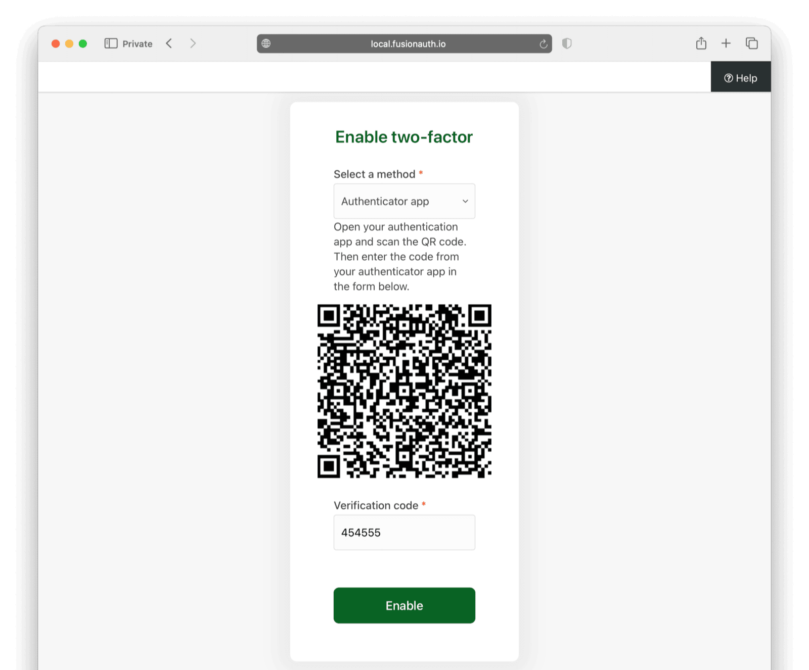

Cyberattacks are on the rise, yet nearly 90% of businesses still rely solely on passwords for user authentication, leaving their systems vulnerable to breaches. The consequences of weak security are severe—47% of breached businesses in 2023 lacked multi-factor authentication (MFA). 

Despite its benefits, many businesses see MFA as too complicated to implement. This hesitation comes down to:

- **Login Friction And User Resistance:** Extra authentication steps can frustrate users, leading to higher churn rates, fewer conversions, and lost revenue.
- **Technical Complexity:** While SMS- and email-based MFA are easy to implement, integrating more advanced methods like TOTP, biometrics, or push notifications across multiple platforms adds complexity. Developers end up spending more time managing security than building core features.
- **Resource And Cost Concerns:** Maintaining MFA requires infrastructure, third-party providers, and compliance measures, which some companies fear will introduce high costs.

Integrating MFA doesn’t have to be an arduous task. Businesses can adopt strong authentication by understanding how MFA works and addressing common implementation challenges—without adding unnecessary complexity.

This guide demystifies MFA by exploring how it works, its authentication flow, practical challenges in its deployment, and how you can smoothly integrate MFA into your application using FusionAuth.

## What Is MFA?

MFA operates on a simple premise: A password alone is not enough. To strengthen security, users must provide one or more additional factors to verify their identity.

The most common form of MFA is two-factor authentication (2FA): A user provides both a password and a second factor, like a one-time password (OTP), before gaining access.

While 2FA requires exactly two factors, MFA can include additional authentication steps for greater security. For example, a multi-factor login process may involve:

- Entering a password.
- Entering a one-time code from an authenticator app.
- Providing biometric verification, such as a fingerprint scan.

In MFA, a factor is a distinct piece of information that verifies a user's identity. A factor can be:

- **Something You Know:** A secret that only the user knows, like passwords, PINs, or security questions.
- **Something You Have:** A physical or digital possession that can confirm identity, such as authenticator apps, security keys, and smart cards.
- **Something You Are:** A biological or behavioral characteristic unique to the user, like fingerprints, facial recognition, or iris scans.

MFA requires two or more of these factors to be valid. Even if one factor is compromised, the system remains secure because an attacker would still need the second factor to gain access.

## Why Is MFA Important?

The benefits of MFA extend beyond strengthening authentication and include:

- **Compliance With Regulations:** Many industries require MFA to meet legal and regulatory standards such as GDPR, HIPAA, and PCI DSS. Implementing MFA simplifies audit processes by providing built-in reporting features that demonstrate compliance.
- **Improved User Experience:** MFA offers flexible authentication methods, including biometrics and push notifications, ensuring users can verify their identity with minimal friction. MFA also reduces account lockouts caused by forgotten passwords, leading to fewer support requests.
- **Adaptability Across Use Cases:** MFA adapts to different security needs, whether for a B2C app using simple OTPs or a B2B system requiring hardware tokens.
- **Reduced Fraud And Account Takeovers:** Over [300 million fraudulent sign-in attempts](https://explodingtopics.com/blog/cybersecurity-stats) are made on cloud servers daily, and MFA blocks 99.99% of them. Even if an attacker compromises login credentials, MFA adds an extra verification step, preventing unauthorized access and reducing fraud risks.
- **Increased Security Layers:** MFA protects against phishing, credential stuffing, and brute force attacks. MFA also reduces reliance on passwords alone, making unauthorized access significantly more difficult.

#### MFA Use Cases

MFA is widely used across industries to protect sensitive data and secure access to critical systems. Businesses implement MFA to protect against cyber threats while ensuring compliance with industry regulations. Below are some common use cases:

- **Enterprise Security (B2B):** Companies implement MFA using hardware tokens or push notifications to ensure that only authorized employees can access corporate systems.

- **Customer Applications (B2C):** E-commerce platforms use OTPs to verify transactions and prevent unauthorized purchases.

- **Healthcare Systems:** Medical professionals use biometric authentication to access patient records, ensuring compliance with HIPAA regulations.

- **Financial Services:** Banks use adaptive authentication to detect and challenge suspicious login attempts in real time, preventing fraudulent transactions.

- **IoT Devices:** Smart home systems require MFA to prevent unauthorized access to connected devices, adding an extra layer of security.

## How MFA Works

In a standard authentication flow, users enter a username and password. If both are correct, the user gains access immediately.

In an MFA flow, the process introduces a second factor (or more) for added security:

1. The user enters their username and password.
2. If correct, they are prompted to verify a second factor—this could be an OTP, a security key, or biometric authentication. For example, if the user has configured MFA via email, they will receive a one-time password (OTP) by email.
3. The user provides the required second factor, such as an OTP received by email. If the factor is valid, access is granted. If not, access is denied.

In case of repeated failed attempts, the system can trigger a security alert via email or SMS, notifying the user of a potential intrusion attempt.

Here is a flowchart illustrating how MFA works:


> Implement an alert system that immediately notifies the user if the MFA fails. This allows them to take action to secure their account, such as resetting their password, since a failed MFA attempt often indicates that an attacker has obtained their password.

### Types Of MFA Methods

Email verification is just one MFA method among many available options. Here are some of the most commonly used MFA methods:

- **One-Time Passwords (OTPs):** Temporary codes sent via SMS, email, or authentication apps that expire after a short period. OTPs are usually the first MFA solution businesses implement, as they require no additional hardware and integrate easily with existing authentication systems.
- **Push Notifications:** A login request is sent to a registered device for approval or denial. Push notifications are a good MFA method to use if your business has a mobile or web app and you want users to verify logins with a quick tap.
- **Biometric Authentication:** Relies on unique biological traits like fingerprints, facial recognition, or voice patterns. Use biometric authentication if your app supports mobile authentication and wants fast, seamless verification.
- **Hardware Tokens:** Physical security devices that generate authentication codes or provide cryptographic validation. Use hardware tokens for high-security environments like corporate networks, financial institutions, or government agencies.
- **Adaptive Authentication:** Analyzes user behavior, location, and device risk to adjust security dynamically. Adaptive authentication is well suited to applications that serve a global user base, ensuring that suspicious logins—such as those from a different country or unusual device—trigger additional verification steps.

Each MFA method strikes a different balance between security and user convenience. To enhance adaptability, consider implementing multiple options based on your needs.

## How To Implement MFA With FusionAuth

FusionAuth provides a flexible and developer-friendly MFA solution that enables businesses to integrate time-based OTP (TOTP), email, SMS, and WebAuthn authentication in minutes using the admin UI or API. FusionAuth supports three MFA methods:

- Using an authenticator app like Google Authenticator or Yubikey.
- SMS authentication (with built-in Twilio integration).
- Email authentication, which works with any provider.

Depending on your use case, you can enable MFA through the FusionAuth Admin Dashboard for quick configuration or using the API if you manage authentication from your own UI. The Admin Dashboard is ideal for quick setups, manual management, or enabling MFA for users without writing code. The API allows you to integrate MFA into custom authentication flows within your application or custom UI.

If you're interested in **passwordless authentication**, FusionAuth can authenticate users without requiring a traditional password. For more details, see our [Comprehensive Guide To Passwordless Authentication](/blog/comprehensive-guide-to-passwordless-authentication).

The examples below are based on the [FusionAuth Express Starter](https://github.com/FusionAuth/fusionauth-example-express-start-here). The instructions for setting up MFA using the FusionAuth API extend the FusionAuth Express Starter to include a settings page where users can manage their MFA settings. The completed application can be found [here](https://github.com/FusionAuth/fusionauth-example-express-mfa).

### Setting Up MFA From The FusionAuth Admin Dashboard

MFA in FusionAuth can be configured at the tenant level, meaning all applications under a tenant inherit its MFA settings by default. If you want to configure MFA at the application level, you'll need an [Enterprise plan](/pricing?step=plan&hosting=self-hosting). 

Application-level MFA settings override tenant-level configurations. Learn more about application-specific MFA settings in the [Multi-Factor Authentication guide](/docs/lifecycle/authenticate-users/multi-factor-authentication#application-set-up).

To enable MFA for a tenant, select **Tenants** in the FusionAuth admin UI sidebar, then select the tenant.

Navigate to the **Multi-Factor** tab and set your MFA policy requirements in the **On login** field.

In the example below, the MFA policy is set to `Required at Login`, meaning users must configure MFA before gaining access.


Now select the authentication methods you want to support:

- Authenticator settings: Enable authenticator settings to allow users to authenticate using TOTP-based apps like Google Authenticator or Yubikey.
- Email settings: You'll need an email provider and FusionAuth license to configure email authentication. Ensure your email server is configured under the **Email** tab on your tenant page.
- SMS settings: You'll need a FusionAuth license to configure SMS authentication. On the **Settings -> Messengers** page, you can configure Twilio for automatic integration or manually set up a custom SMS gateway.

Once this configuration is complete, users logging in will be redirected to a page prompting them to configure MFA before gaining access.


In the screenshot above, the user can set up MFA using TOTP or email.

If the user selects the **Authenticator app** option, they will be presented with a QR code. The user scans the QR code using an authenticator app like Google Authenticator, and then enters the generated TOTP code to proceed.



When MFA is enabled, FusionAuth displays recovery codes that the user can use to recover their account.

If the user selects the **Email** MFA option, an OTP is sent to their registered email. The user enters this code on the login page to verify their identity, and gains access to their account.


Use the FusionAuth admin UI to set up MFA in the following cases:

- **You have a limited user base:** If you're managing few users, handling MFA from the dashboard is efficient.
- **You need direct control over MFA settings:** The admin UI allows administrators to enforce MFA policies and configure settings without additional development work.

### Implementing MFA Using The FusionAuth API

If you're implementing a custom authentication workflow, it's more practical to use the FusionAuth API, as it provides better control over the authentication flow and allows users to enable MFA within their own settings page rather than being required to set it up at login. In most real-world scenarios, users can log in normally and configure MFA later from their account settings. 

The following sections show you how to implement MFA using the API and the [TypeScript SDK](/docs/sdks/typescript).

When MFA is implemented, users will be able to enable their preferred MFA method from their account settings page. The page displays the following available MFA options:

- Authenticator App
- Email 2FA
- SMS 2FA


When the user clicks the button to enable their preferred MFA method, the backend generates the required authentication secrets, stores them in cookies, and redirects the user to the setup page for the selected MFA method.

#### MFA Using An Authenticator App

When a user selects the Authenticator App (TOTP) method, a request is sent to FusionAuth to generate the necessary two-factor authentication secrets.

```typescript
// app/src/index.ts

app.get('/mfa/authenticator', async (req, res) => {
  const userTokenCookie = req.cookies[userToken];
  if (!await validateUser(userTokenCookie)) {
    res.redirect(302, '/');
  } else {

    const { userId } = userTokenCookie;
    if (!userId) {
      throw new Error('No user id found in cookie');
    }

    const authenticatorTokens = await client.generateTwoFactorSecret();

    res.cookie('authenticator-secret', authenticatorTokens.response?.secret);
    res.cookie('authenticator-qr-code', authenticatorTokens.response?.secretBase32Encoded);

    res.sendFile(path.join(__dirname, '../templates/authenticator-setup.html'));
  }
});
```

FusionAuth responds with two secrets, one in standard format and one in Base32-encoded format:

- **Secret Key:** Used internally for authentication.
- **Base32-Encoded Secret:** Used to generate a QR code that the user can scan with an authenticator app.

The user is then presented with a QR code setup page, where they can scan the code or manually enter the Base32-encoded secret key into their authenticator app.


Next, the user verifies their authenticator app by entering a TOTP, which FusionAuth processes using the `enableTwoFactor` method to complete the setup.

```typescript
// app/src/index.ts

app.post('/mfa/verify-authenticator', async (req, res) => {

  try {
  // ...
    const {code, secret, qrCodeData} = req.body;
    if (!code) {
      throw new Error('No code provided');
    }

    const verifyResponse = await client.enableTwoFactor(
      userId,
      {
        code,
        method: 'authenticator',
        secret: secret,
        secretBase32Encoded: qrCodeData,
      }
    )

    res.json(JSON.stringify({
      recoveryCodes: verifyResponse.response.recoveryCodes,
    }))
  } catch (err: any) {
    console.error(err);
    res.status(err?.statusCode || 500).json(JSON.stringify({
      error: err
    }))
  }

});
```

Once verified, MFA is enabled, and the user receives recovery codes.


#### MFA Using Email 2FA

When a user opts to use email MFA, a verification code is sent to their registered email, and they are prompted to enter it on the verification page.

```typescript
// app/src/index.ts

app.get('/mfa/email', async (req, res) => {
  try {

      // ...

      // Retrieve user details
      const userResponse = await client.retrieveUser(userId);
      const userEmail = userResponse?.response.user?.email;

      if (!userEmail) {
        throw new Error('User email not found');
      }

      // Send the email verification code
      await client.sendTwoFactorCodeForEnableDisable({
        userId,
        email: userEmail,
        method: 'email',
      });

      // Display the email MFA setup page
      res.sendFile(path.join(__dirname, '../templates/email-setup.html'));
    }

  } catch (error) {
    res.status(500).send("Failed to send email verification code. Please try again.");
  }
});
```

The email verification code page might look like this:


When the user enters their verification code, the backend validates it using the FusionAuth API:

```typescript
// app/src/index.ts

app.post('/mfa/verify-email', async (req, res) => {
  try {

    // ...

    const { code, email } = req.body;
    if (!code) {
      throw new Error('No code provided');
    }

    // Verify the email authentication code
    const verifyResponse = await client.enableTwoFactor(
      userId,
      {
        code,
        method: 'email',
        email,
      }
    );

    res.json(JSON.stringify({
      code: verifyResponse.response.code,
    }));

  } catch (err: any) {
    console.error("Error in /mfa/verify-email:", err.exception.fieldErrors);

    res.status(err?.statusCode || 500).json(JSON.stringify({
      error: err
    }));
  }
});
```

#### MFA Using SMS 2FA

To enable SMS 2FA, the user must have a registered phone number to receive the verification code.

```typescript
// app/src/index.ts

app.get('/mfa/sms', async (req, res) => {
  try {
    const userTokenCookie = req.cookies[userToken];
    if (!await validateUser(userTokenCookie)) {
      res.redirect(302, '/');
    } else {

      const { userId } = userTokenCookie;
      if (!userId) {
        throw new Error('No user ID found in cookie');
      }

      // Retrieve user details
      const userResponse = await client.retrieveUser(userId);
      const phoneNumber = userResponse?.response.user?.data?.mobilePhone;

      if (!phoneNumber) {
        return res.status(400).send("No phone number found. Please set a phone number first.");
      }

      // Send SMS verification code
      await client.sendTwoFactorCodeForEnableDisable({
        userId,
        method: 'sms',
        mobilePhone: phoneNumber,
      });

      // Display the SMS MFA setup page
      res.sendFile(path.join(__dirname, '../templates/sms-setup.html'));
    }

  } catch (error) {
    res.status(500).send("Failed to send SMS verification code. Please try again.");
  }
});
```

The user enters the code received via SMS and it is validated to complete the MFA setup.

```typescript
// app/src/index.ts

app.post('/mfa/verify-sms', async (req, res) => {
  try {
    const { code, phone } = req.body;
    if (!code) {
      throw new Error('No code provided');
    }

    // Verify the SMS authentication code
    const verifyResponse = await client.enableTwoFactor(
      userId,
      {
        code,
        method: 'sms',
        mobilePhone,
      }
    );

    res.json(JSON.stringify({
      code: verifyResponse.response.code,
    }));

  } catch (err: any) {
    console.error("Error in /mfa/verify-sms:", err.exception.fieldErrors);

    res.status(err?.statusCode || 500).json(JSON.stringify({
      error: err
    }));
  }
});
```

### Managing MFA Beyond Activation

Enabling MFA is just the first step. Effective management includes disabling MFA when needed, handling recovery codes, and using step-up authentication for sensitive actions.

FusionAuth provides several API methods to help with MFA management.

#### Disabling MFA For A User

To use the [Disable Multi-Factor API](/docs/apis/two-factor#disable-multi-factor), a user must provide a valid **MFA verification code** or **recovery code**. 

The request below disables MFA for a user.

```http
DELETE /api/user/two-factor/{userId}?code={code}&methodId={methodId}
```

- `userId`: The Id of the user whose MFA is being disabled.
- `code`: The MFA verification code (OTP or recovery code).
- `methodId`: The MFA method to disable (for example, authenticator app or email).

If a recovery code is used, all MFA methods will be removed.

```http
DELETE /api/user/two-factor/85a03867-dccf-4882-adde-1a79aeec50df?code=QJD73-L6GR5&methodId=email
```

#### Generating And Retrieving Recovery Codes

Use the [Generate Recovery Codes API](/docs/apis/two-factor#generate-recovery-codes) to generate a list of recovery codes. Recovery codes allow users to access their accounts if they lose access to their primary MFA method. By default, FusionAuth generates 10 single-use recovery codes when MFA is enabled. If a user exhausts or loses their recovery codes, they can request new ones.

```http
POST /api/user/two-factor/recovery-code/{userId}
```

#### Retrieve Existing Recovery Codes

Use the [Retrieve Recovery Codes API](/docs/apis/two-factor#retrieve-recovery-codes) to retrieve a user's recovery codes.

```http
GET /api/user/two-factor/recovery-code/{userId}
```

- `userId`: The Id of the user requesting new or existing recovery codes.

The following example shows a response with recovery codes.

```json
{
  "recoveryCodes": [
    "QJD73-L6GR5",
    "R7RJH-GB7H3",
    "JJ5YZ-KS4C3",
    "CRDHP-7L355",
    "928QS-P9HMJ",
    "8VLFT-Z2WMM",
    "PQZX9-YV5VR",
    "TK9TB-7BT6H",
    "6QYPL-ZPQJV",
    "VJ35W-98RW4"
  ]
}
```

#### Using MFA For Step-Up Authentication

MFA protects more than just logins—it also enables step-up authentication for sensitive actions like transferring funds or updating security settings. 

Use the [Start Multi-Factor API](/docs/apis/two-factor#start-multi-factor) to initiate a step-up authentication challenge.

```http
POST /api/two-factor/start
```

- `userId`: The Id of the user performing a sensitive action.
- `state` (optional): Additional metadata about the action being performed.

For example, if a user attempts to transfer money, an MFA challenge can be initiated before the transaction is completed.

```
POST /api/two-factor/start
{
  "userId": "85a03867-dccf-4882-adde-1a79aeec50df",
  "state": {
    "action": "transfer_funds"
  }
}
```

The response will include a `twoFactorId`, which will be required to complete the MFA challenge before proceeding.

```json
{
  "message": "MFA challenge initiated.",
  "twoFactorId": "DvnAUMCHLxCCAWyHXOVWPQd8ZY0a6U0e3YpYkT0MNxs"
}
```

Complete the multi-factor process by sending a [request to complete the MFA challenge](/docs/apis/two-factor#send-a-multi-factor-code-during-login-or-step-up).

```
POST /api/two-factor/login
{
  "twoFactorId": "DvnAUMCHLxCCAWyHXOVWPQd8ZY0a6U0e3YpYkT0MNxs",
  "code": "123456"
}
```

If the code is correct, the user will be successfully authenticated. If incorrect, an error response will be returned, and the user may need to request a new MFA code.

## Choosing The Right MFA Solution

The right MFA solution should align with your business's infrastructure, security requirements, and user experience priorities.

MFA solutions come in different deployment models, each offering varying levels of control, scalability, and flexibility:

- **Cloud-Based Solutions:** Fully managed services hosted in the cloud for quick deployment and scalability, for example, [Auth0](https://auth0.com/) and FusionAuth.
- **On-Premises Solutions:** Self-hosted options offering full control over data and infrastructure, for example, FusionAuth and [Keycloak](https://www.keycloak.org/).
- **Hybrid Solutions:** Combine cloud and on-premises features for flexibility, for example, [Ping Identity](https://www.pingidentity.com/en.html).

MFA solutions also vary in focus, with some designed for developers building custom integrations and others tailored for enterprise-scale security and compliance needs:

- **Developer-Centric Solutions:** Provide APIs and SDKs for seamless integration into custom applications, for example, FusionAuth.
- **Enterprise-Focused Solutions:** Prioritize scalability and compliance for large organizations, for example, [Microsoft Azure AD B2C](https://learn.microsoft.com/en-us/azure/active-directory-b2c/overview).

## 9 Key Features To Look For In An MFA Solution

Choosing an MFA solution goes beyond selecting a provider—it must balance security with usability, ensuring strong authentication without adding unnecessary friction. Here are the essential features to consider when evaluating an MFA platform:

1. Support for diverse authentication methods (OTP, biometrics, push notifications).
2. Adaptive authentication capabilities based on risk analysis.
3. Seamless integration with existing applications via APIs or SDKs.
4. Customizable workflows tailored to your business needs.
5. High availability and scalability for large user bases.
6. Robust reporting tools for compliance audits.
7. User-friendly interfaces that enhance adoption rates.
8. Support for offline authentication methods like hardware tokens.
9. Compatibility with modern security standards like `FIDO2/WebAuthn`.

## Developer's Checklist For Evaluating MFA Solutions

An MFA solution should be secure, flexible, and easy to integrate for technical teams. Whether adding MFA to a new or existing system, developers should consider key factors affecting usability and maintenance. Here’s a **quick checklist** for evaluating an MFA solution from a developer’s perspective:

- Does the solution support modern protocols like [WebAuthn](/docs/lifecycle/authenticate-users/passwordless/webauthn-passkeys)?
- Are APIs well-documented and easy to integrate?
- Can MFA policies be customized based on user roles or risk profiles?
- Is there support for fallback options in case of lost devices?

## Final Thoughts

MFA is a critical layer of security that addresses many of the threats modern businesses face. By requiring multiple factors for authentication, MFA helps to:

- Protect you and your users from credential theft by requiring secondary verification.
- Block unauthorized access to your application, even in phishing attacks.
- Secure remote access and ensure compliance with industry regulations.

However, security doesn't stop at MFA. As cyber threats evolve, businesses must adopt stronger authentication mechanisms to stay ahead. One solution is passwordless authentication, which eliminates passwords entirely while maintaining security and usability.

Want to take authentication a step further? Learn how to implement passwordless authentication in our [comprehensive guide](/blog/comprehensive-guide-to-passwordless-authentication).
