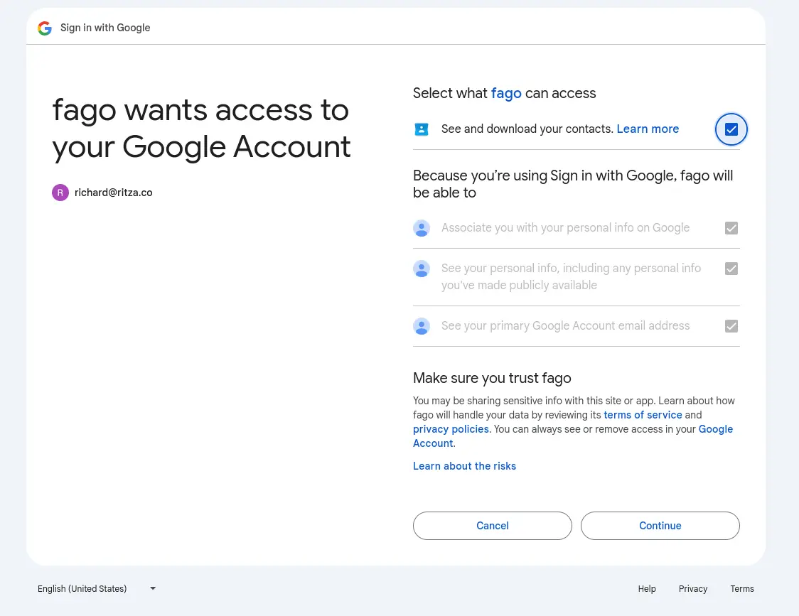

import Aside from 'src/components/Aside.astro';
import IconButton from 'src/components/IconButton.astro';
import Breadcrumb from 'src/components/Breadcrumb.astro';
import InlineField from 'src/components/InlineField.astro';
import InlineUIElement from 'src/components/InlineUIElement.astro';

## Introduction

You don't want to use the Google Identity Provider because it doesn't support the prompt URL parameter.
Use the OIDC Identity Provider with the prompt parameter set to select_account to let the users pick different accounts

## Run code

```sh
cd ~/code/rjeritza/16_faGoogleConnect
docker compose up
# new terminal
cd completeApplication
npm install  # todo use docker here too
npm run start

```

## Set up project in Google console

- First register the domain you want to use with Google here - https://search.google.com/search-console/about
  - For testing purposes if you want to make a free domain, use https://www.cloudns.net, and point it to a free Google Sites website
- Configure Google as shown here - https://fusionauth.io/docs/lifecycle/authenticate-users/identity-providers/social/google
- Delete insturctions below
- https://console.cloud.google.com
- new project - fago
- In the API Library, enable Google People API
- Configure Consent Screen
- Choose user type `External` unless you want Internal users only (https://support.google.com/cloud/answer/10311615#user-type&zippy=%2Cexternal%2Cinternal)
- App name `fago`
- Upload any 120 px by 120 px image
- Enter the urls of your website
- Save and continue
- Click Add or remove scopes, enable `.../auth/contacts.readonly` `See and download your contacts`
- Save and continue
- Add your own gmail address as a test user
- Save and continue
- If it says ` Ineligible accounts not added. The following email addresses are either not associated with a Google Account or the account is not eligible for designation as a test user` ignore it
- APIs & Services - Credentials
- Create Credentials - OAuth Client ID
- Web application
- Name: fago
- Add https://localhost:3000 for `Authorized JavaScript origins` and `Authorized redirect URIs`. Add redirect URI `http://localhost:9011/oauth2/callbackflowName=GeneralOAuthFlow` and `http://localhost:9011`
- Create
- Save client id and secret

## Set up identity provider in FusionAuth

https://fusionauth.io/docs/lifecycle/authenticate-users/identity-providers/
says go [Settings -> Identity Providers ](http://localhost:9011/admin/identity-provider)
`Add OpenID Connect`, not `Add Google`. You don't want to use the Google Identity Provider because it doesn't support the `prompt` URL parameter.
- id 26481189-e3f7-433f-804b-9643a025806a
- name connectgoo
- Client Id - enter from google console
- Client secret - enter from google console
- Enable `Discover endpoints`
- Enter `https://accounts.google.com` for Issuer
- For Scope, enter `profile email https://www.googleapis.com/auth/contacts.readonly`
- For `Linking strategy`, set to `Create a pending link`
- Enable `Debug enabled`
- Enabled `Enabled` for `Example app`
- Click the Save icon at the top right

- https://fusionauth.io/docs/lifecycle/authenticate-users/identity-providers/social/google#custom-parameters
- `access_type=offline` if you want a refresh token from Google.
- `prompt=select_account` if you want to force an account selection screen.

## Add login button in app

- http://localhost:9011/api/identity-provider/login
- url:
  - https://accounts.google.com/o/oauth2/v2/auth?client_id=535042435541-eridnie9d09pa69dsq1hh066ushvp4e0.apps.googleusercontent.com&redirect_uri=http://localhost:9011/api/identity-provider/login&response_type=code&scope=openid%20email%20profile%20https://www.googleapis.com/auth/contacts.readonly&state=STATE&idp_hint=26481189-e3f7-433f-804b-9643a025806a

redirects to: `http://localhost:9011/api/identity-provider/login?state=STATE&code=4/0AVG7fiTXd3CnP6OxUg_iSelh4f2VqB9DNGqueD9jL5ElbzR7D-ff3ga7Zs5BXgHoUbvnPw&scope=email%20profile%20https://www.googleapis.com/auth/contacts.readonly%20openid%20https://www.googleapis.com/auth/userinfo.profile%20https://www.googleapis.com/auth/userinfo.email&authuser=1&hd=ritza.co&prompt=consent`



note the api key types here https://fusionauth.io/docs/apis/authentication. e.g. completel login requires on authentication.

TODO - change redirect url to my app instead of FA, and call API manually - https://fusionauth.io/docs/apis/identity-providers/openid-connect#complete-an-openid-connect-login

## Todo


- https://drafts.cc.ritza.co/s/CIi3qE_d0#
- read:
  - https://fusionauth.io/community/forum/topic/2569/how-do-i-call-a-google-api-or-retrieve-the-google-credentials
  - https://fusionauth.io/community/forum/topic/2659/access-google-calendars-of-multiple-google-accounts-with-user-permission

- goal: get user's contacts' email addresses from google
- process:
  - user logs in to changebank/fusionauth with username/password (this with email or google button though?)
  - button calls FA identity provider login OIDC API to login to google (i assume https://fusionauth.io/docs/apis/identity-providers/openid-connect)
    - login uses Google scope https://www.googleapis.com/auth/contacts.readonly
  - after login, application gets refresh token from FA.
  - app gets contact list from google api with refresh token

- fa account must be linked to one or more google accounts

- STATE change in code