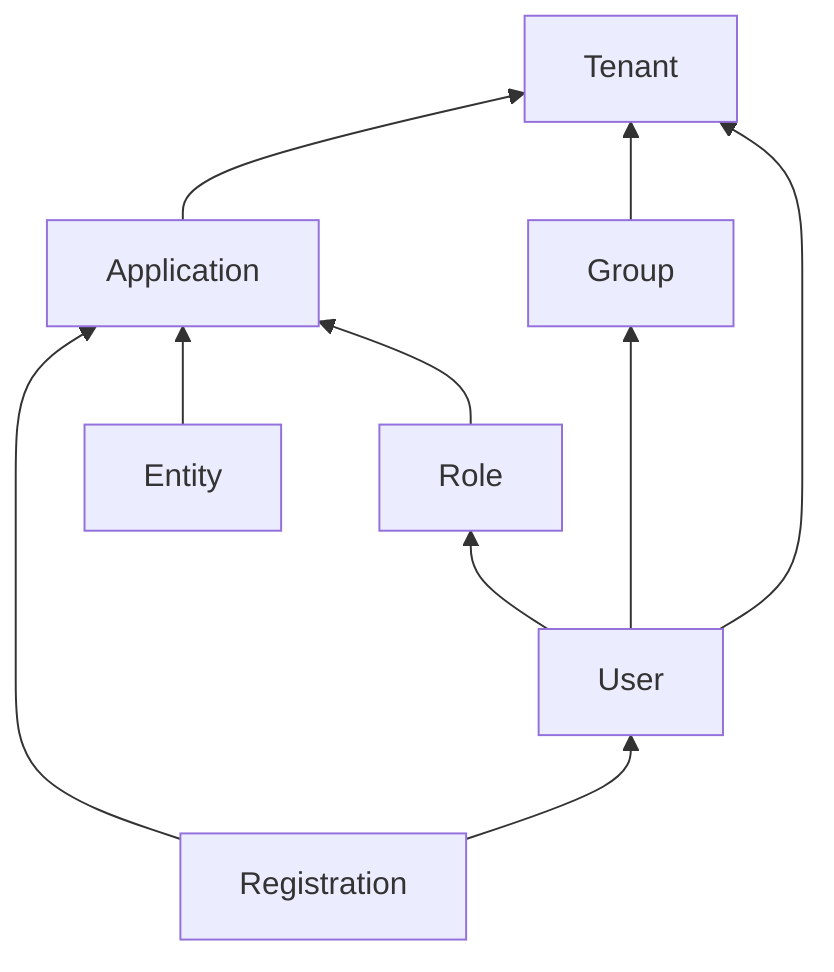

- [Introduction](#introduction)
- [Definitions](#definitions)
- [Types of User Actions](#types-of-user-actions)
  - [Time Based User Actions](#time-based-user-actions)
    - [Time based action](#time-based-action)
  - [Option Based](#option-based)
    - [Option based action](#option-based-action)
- [What Happens After a User Action](#what-happens-after-a-user-action)
  - [Webhooks](#webhooks)
  - [Emails to the actioned user](#emails-to-the-actioned-user)
- [Creating Actions](#creating-actions)
  - [Using the FusionAuth Administration Website](#using-the-fusionauth-administration-website)
  - [Creating an API key](#creating-an-api-key)
  - [APIs](#apis)
  - [Creating a User Action via the API (create both types)](#creating-a-user-action-via-the-api-create-both-types)
  - [Setting up a Webhook -- why? so we can feed the subscription and happiness info into our other systems? have an audit trail?](#setting-up-a-webhook----why-so-we-can-feed-the-subscription-and-happiness-info-into-our-other-systems-have-an-audit-trail)
  - [Set up the Email](#set-up-the-email)
  - [Executing the User Action (execute both)](#executing-the-user-action-execute-both)
    - [Webhook Example](#webhook-example)
    - [Show example of email](#show-example-of-email)
  - [Querying Action Status on a User (query both) and explain why you'd do this](#querying-action-status-on-a-user-query-both-and-explain-why-youd-do-this)
- [Localization -- extract all the localization stuff to here](#localization----extract-all-the-localization-stuff-to-here)
- [Further reading](#further-reading)

## Introduction
User Actions in FusionAuth are ways to interact with, reward, and discipline users. For example, you could use them to temporarily disable a user's login, email a user, or call another application when a certain event occurs. From here on we'll refer to User Actions just as Actions.

An Action can be used for all tenants or just a few. Below is a reminder of [Tenants, Groups, and Applications](https://fusionauth.io/docs/v1/tech/core-concepts/).

## Definitions
Below are all definitions related to an Action.
- Action - Has three parts:
  - the event, or condition, that triggers the action,
  - the action taken (running some code),
  - and the user on whom the action is performed.
- Actioner -
- Actionee -
- Actioning a user -
- Temporal -
- ... -

## Types of User Actions
Add a table of the types:
Type | Use | example
Time based | When you want to apply something for a given period of time. | subscription access, forum ban
Option based | When you want to apply certain value to a user, recording who did so, perhaps with comments | user surveyed and was happy/frustrated/indifferent

And an explanation of how you use these in general:

create a user action
apply it to users via the API or admin UI (actioning)

### Time Based User Actions
add a diagram of the flow:
started -> modified (could loop to this) -> ended
\ (or)
---> cancelled

#### Time based action
Example of the subscription from the blog.

### Option Based
Option
add a diagram of the flow: added -> removed

#### Option based action
Another example. How about an option that records interaction with a user and a customer service rep, assigns it a impact rating (high, medium, low) and includes a comment.

## What Happens After a User Action
nothing, just a record that it happened and who did it.

### Webhooks

### Emails to the actioned user

## Creating Actions
Tell a story here (or introduce it above and expand on it below). You already have the subscription example, so let's tell the story of Pied Piper expanding into media and building out both a subscription and a lightweight user happiness system for their customer service agents. Goal is to make it like this: https://fusionauth.io/docs/v1/tech/guides/multi-tenant in terms of telling a real world story.

### Using the FusionAuth Administration Website
You can create an Action on the website at **Settings** — **User Actions**.

### Creating an API key

### APIs
Three separate APIs manage Actions. Each has its own documentation.
- [User Actions](https://fusionauth.io/docs/v1/tech/apis/user-actions)
  - Defines an action, updates it, and deletes it.
- [Applying User Actions](https://fusionauth.io/docs/v1/tech/apis/actioning-users)
  - Applies an Action to a User.
- [User Action Reasons](https://fusionauth.io/docs/v1/tech/apis/user-action-reasons)
  - Allows you to

### Creating a User Action via the API (create both types)

### Setting up a Webhook -- why? so we can feed the subscription and happiness info into our other systems? have an audit trail?

### Set up the Email
Set up sending a thank you email to the user when their interaction has been recorded.

### Executing the User Action (execute both)

#### Webhook Example
Show example of what webhook would look like when received and link to the webhook event documentation

#### Show example of email

### Querying Action Status on a User (query both) and explain why you'd do this

## Localization -- extract all the localization stuff to here
options
name
emails (point to email templates docs, no need to build this out entirely), but note that the email template is pulled based on the users preferred email
anything else

## Further reading